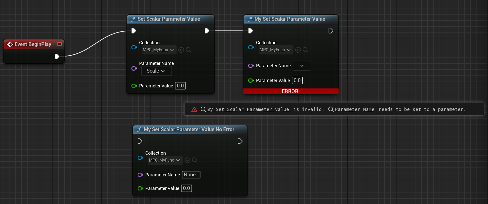

# MaterialParameterCollectionFunction

- **功能描述：** 指定该函数是用于操作UMaterialParameterCollection，从而支持ParameterName的提取和验证
- **使用位置：** UFUNCTION
- **引擎模块：** Material
- **元数据类型：** bool
- **限制类型：** 带有UMaterialParameterCollection参数的函数
- **常用程度：** ★★★

指定该函数是用于操作UMaterialParameterCollection，从而支持ParameterName的提取和验证。

## 测试代码：

```cpp

UCLASS(Blueprintable, BlueprintType)
class INSIDER_API UMyFunction_Material :public UBlueprintFunctionLibrary
{
public:
	GENERATED_BODY()
public:
	UFUNCTION(BlueprintCallable, meta=(WorldContext="WorldContextObject", MaterialParameterCollectionFunction))
	static void MySetScalarParameterValue(UObject* WorldContextObject, UMaterialParameterCollection* Collection, FName ParameterName, float ParameterValue);

	UFUNCTION(BlueprintCallable, meta=(WorldContext="WorldContextObject"))
	static void MySetScalarParameterValue_NoError(UObject* WorldContextObject, UMaterialParameterCollection* Collection, FName ParameterName, float ParameterValue);
};
```

## 蓝图中效果：

引擎自带的UKismetMaterialLibrary::SetScalarParameterValue和我们自己手动编写的MySetScalarParameterValue，会触发材质参数集合的蓝图节点验证检测。如果没有指定ParameterName，则会产生编译错误。而没有MaterialParameterCollectionFunction标记的MySetScalarParameterValue_NoError函数版本则只是当作一个普通的函数一样，一是不会自动提取MPC中的Parameters集合来选择，二是没有ParameterName为空的错误验证。



## 原理：

```cpp
UBlueprintFunctionNodeSpawner* UBlueprintFunctionNodeSpawner::Create(UFunction const* const Function, UObject* Outer/* = nullptr*/)
{
	bool const bIsMaterialParamCollectionFunc = Function->HasMetaData(FBlueprintMetadata::MD_MaterialParameterCollectionFunction);
	if (bIsMaterialParamCollectionFunc)
	{
		NodeClass = UK2Node_CallMaterialParameterCollectionFunction::StaticClass();
	}
	else
	{
		NodeClass = UK2Node_CallFunction::StaticClass();
	}
}

TSharedPtr<SGraphNode> FNodeFactory::CreateNodeWidget(UEdGraphNode* InNode)
{
		if (UK2Node_CallMaterialParameterCollectionFunction* CallFunctionNode = Cast<UK2Node_CallMaterialParameterCollectionFunction>(InNode))
		{
			return SNew(SGraphNodeCallParameterCollectionFunction, CallFunctionNode);
		}
}
TSharedPtr<SGraphPin> SGraphNodeCallParameterCollectionFunction::CreatePinWidget(UEdGraphPin* Pin) const
{
	//提取MPC中参数列表等操作
		if (Collection)
		{
			// Populate the ParameterName pin combobox with valid options from the Collection
			const bool bVectorParameters = CallFunctionNode->FunctionReference.GetMemberName().ToString().Contains(TEXT("Vector"));
			Collection->GetParameterNames(NameList, bVectorParameters);
		}
}
```

MaterialParameterCollectionFunction这个标记的，会采用UK2Node_CallMaterialParameterCollectionFunction来验证材质函数的正确书写与否。同时UK2Node_CallMaterialParameterCollectionFunction这个蓝图节点也在引擎内部继续被识别以进一步定制化ParameterName的Pin节点。

引擎源码内采用MaterialParameterCollectionFunction标记的函数只有UKismetMaterialLibrary里的函数。