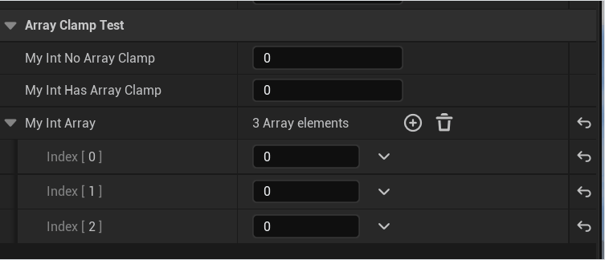

# ArrayClamp

- **功能描述：** 限定整数属性的值必须在指定数组的合法下标范围内，[0,ArrayClamp.Size()-1]
- **使用位置：** UPROPERTY
- **引擎模块：** Numeric Property
- **元数据类型：** int32
- **限制类型：** int32
- **常用程度：** ★★★

限定整数属性的值必须在指定数组的合法下标范围内，[0,ArrayClamp.Size()-1]

## 测试代码：

```cpp
public:
	UPROPERTY(EditAnywhere, BlueprintReadWrite, Category = ArrayClampTest)
	int32 MyInt_NoArrayClamp = 0;

	UPROPERTY(EditAnywhere, BlueprintReadWrite, Category = ArrayClampTest, meta = (ArrayClamp = "MyIntArray"))
	int32 MyInt_HasArrayClamp = 0;

	UPROPERTY(EditAnywhere, BlueprintReadWrite, Category = ArrayClampTest)
	TArray<int32> MyIntArray;
```

## 测试效果：

可见拥有ArrayClamp的整数值被限制在数组的下标中。



## 原理：

根据指定的数组名称在本类里寻找到Array属性，然后把本整数属性的值Clamp在该数组的下标范围内。

```cpp
template <typename Type>
static Type ClampIntegerValueFromMetaData(Type InValue, FPropertyHandleBase& InPropertyHandle, FPropertyNode& InPropertyNode)
{
	Type RetVal = ClampValueFromMetaData<Type>(InValue, InPropertyHandle);

	//enforce array bounds
	const FString& ArrayClampString = InPropertyHandle.GetMetaData(TEXT("ArrayClamp"));
	if (ArrayClampString.Len())
	{
		FObjectPropertyNode* ObjectPropertyNode = InPropertyNode.FindObjectItemParent();
		if (ObjectPropertyNode && ObjectPropertyNode->GetNumObjects() == 1)
		{
			Type LastValidIndex = static_cast<Type>(GetArrayPropertyLastValidIndex(ObjectPropertyNode, ArrayClampString));
			RetVal = FMath::Clamp<Type>(RetVal, 0, LastValidIndex);
		}
		else
		{
			UE_LOG(LogPropertyNode, Warning, TEXT("Array Clamping isn't supported in multi-select (Param Name: %s)"), *InPropertyHandle.GetProperty()->GetName());
		}
	}

	return RetVal;
}
```

## 行为

UE5.8 property metadata；ObjectMacros 标注用于整数属性按指定数组长度限制范围。

## UE5.8 审计结论

- 状态：`verified_UE5.8`。
- 结论：已按 UE5.8 源码验证。
- 证据：
  - UE5.8 `ObjectMacros.h` numeric property metadata declaration/comment
  - UE5.8 Details numeric/color customization metadata usage

## 常见误用

参数名、属性名或目标宏写错导致 metadata 被保留但没有对应编辑器/Blueprint 行为。
