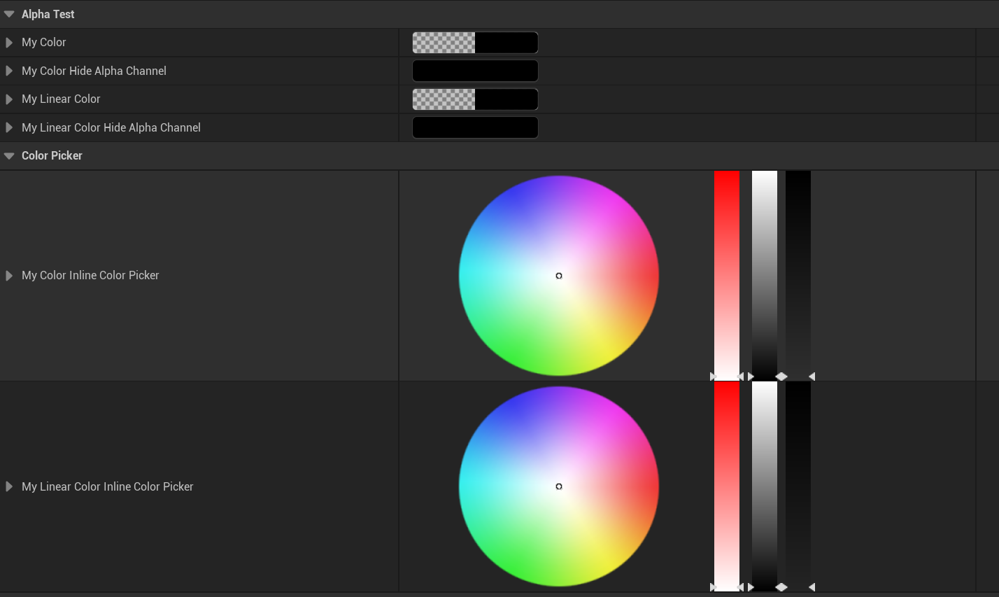

# InlineColorPicker

- **功能描述：** 使FColor或FLinearColor属性在编辑的时候直接内联一个颜色选择器。
- **使用位置：** UPROPERTY
- **引擎模块：** Numeric Property
- **元数据类型：** bool
- **限制类型：** FColor , FLinearColor
- **常用程度：** ★★

使FColor或FLinearColor属性在编辑的时候直接内联一个颜色选择器。

## 测试代码：

```cpp
public:
	UPROPERTY(EditAnywhere, Category = ColorPicker, meta = (InlineColorPicker))
	FColor MyColor_InlineColorPicker;
	UPROPERTY(EditAnywhere, Category = ColorPicker, meta = (InlineColorPicker))
	FLinearColor MyLinearColor_InlineColorPicker;
```

## 测试结果：



## 原理：

根据不同的标记创建不同的的ColorWidget 。

```cpp

void FColorStructCustomization::MakeHeaderRow(TSharedRef<class IPropertyHandle>& InStructPropertyHandle, FDetailWidgetRow& Row)
{
	if (InStructPropertyHandle->HasMetaData("InlineColorPicker"))
	{
		ColorWidget = CreateInlineColorPicker(StructWeakHandlePtr);
		ContentWidth = 384.0f;
	}
	else
	{
		ColorWidget = CreateColorWidget(StructWeakHandlePtr);
	}
}
```

## 行为

UE5.8 color metadata；Details color customization 用于 inline color picker。

## UE5.8 审计结论

- 状态：`verified_UE5.8`。
- 结论：已按 UE5.8 源码验证。
- 证据：
  - UE5.8 `ObjectMacros.h` numeric property metadata declaration/comment
  - UE5.8 Details numeric/color customization metadata usage

## 常见误用

参数名、属性名或目标宏写错导致 metadata 被保留但没有对应编辑器/Blueprint 行为。
