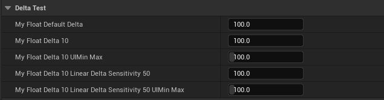

# LinearDeltaSensitivity

- **功能描述：** 在设定Delta后，进一步设定数字输入框变成线性改变以及改变的敏感度（值越大越不敏感）
- **使用位置：** UPROPERTY
- **引擎模块：** Numeric Property
- **元数据类型：** float/int
- **限制类型：** float,int32
- **关联项：** [Delta](Delta/Delta.md)
- **常用程度：** ★★★

生效的条件：

1. 先设置Delta>0
2. 不设置UIMin, UIMax
3. 设定LinearDeltaSensitivity >0

## 测试代码：

```cpp
	UPROPERTY(EditAnywhere, BlueprintReadWrite, Category = DeltaTest, meta = (UIMin = "0", UIMax = "1000", Delta = 10))
	float MyFloat_Delta10_UIMinMax = 100;
	UPROPERTY(EditAnywhere, BlueprintReadWrite, Category = DeltaTest, meta = (Delta = 10, LinearDeltaSensitivity = 50))
	float MyFloat_Delta10_LinearDeltaSensitivity50 = 100;
	UPROPERTY(EditAnywhere, BlueprintReadWrite, Category = DeltaTest, meta = (UIMin = "0", UIMax = "1000", Delta = 10, LinearDeltaSensitivity = 50))
	float MyFloat_Delta10_LinearDeltaSensitivity50_UIMinMax = 100;
```

## 测试效果：

效果解析请参见：Delta的解析



## 原理：

可见只有没有UIMinMax且已经设置Delta后才能走进线性改变的代码分支。

```cpp
, _Delta(0)
virtual FReply SSpinBox<NumericType>::OnMouseMove(const FGeometry& MyGeometry, const FPointerEvent& MouseEvent) override
{
		if (bUnlimitedSpinRange)
		{
				// If this control has a specified delta and sensitivity then we use that instead of the current value for determining how much to change.
				const double Sign = (MouseEvent.GetCursorDelta().X > 0) ? 1.0 : -1.0;

				if (LinearDeltaSensitivity.IsSet() && LinearDeltaSensitivity.Get() != 0 && Delta.IsSet() && Delta.Get() > 0)
				{
								const double MouseDelta = FMath::Abs(MouseEvent.GetCursorDelta().X / (float)LinearDeltaSensitivity.Get());
								NewValue = InternalValue + (Sign * MouseDelta * FMath::Pow((double)Delta.Get(), (double)SliderExponent.Get())) * Step;
				}
				else
				{
								const double MouseDelta = FMath::Abs(MouseEvent.GetCursorDelta().X / SliderWidthInSlateUnits);
								const double CurrentValue = FMath::Clamp<double>(FMath::Abs(InternalValue), 1.0, (double)std::numeric_limits<NumericType>::max());
								NewValue = InternalValue + (Sign * MouseDelta * FMath::Pow((double)CurrentValue, (double)SliderExponent.Get())) * Step;
				}
		}
}

```

## 行为

UE5.8 numeric metadata；ObjectMacros 标注为 unbounded slider 线性灵敏度。

## UE5.8 审计结论

- 状态：`verified_UE5.8`。
- 结论：已按 UE5.8 源码验证。
- 证据：
  - UE5.8 `ObjectMacros.h` numeric property metadata declaration/comment
  - UE5.8 Details numeric/color customization metadata usage

## 常见误用

参数名、属性名或目标宏写错导致 metadata 被保留但没有对应编辑器/Blueprint 行为。
