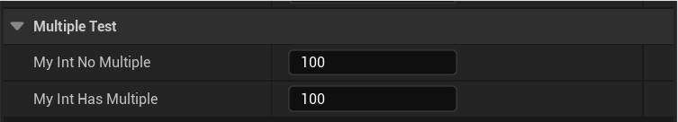

# Multiple

- **功能描述：** 指定数字的值必须是Mutliple提供的值的整数倍。
- **使用位置：** UPROPERTY
- **引擎模块：** Numeric Property
- **元数据类型：** int32
- **限制类型：** int32
- **常用程度：** ★★★

指定数字的值必须是Mutliple提供的值的整数倍。

## 测试代码：

```cpp
public:
	UPROPERTY(EditAnywhere, BlueprintReadWrite, Category = MultipleTest)
	int32 MyInt_NoMultiple = 100;

	UPROPERTY(EditAnywhere, BlueprintReadWrite, Category = MultipleTest, meta = (Multiple = 5))
	int32 MyInt_HasMultiple = 100;
```

## 蓝图效果：

可以看到，拥有Multiple 的只能按照5的倍数来增长。



## 原理：

```cpp
template <typename Type>
static Type ClampIntegerValueFromMetaData(Type InValue, FPropertyHandleBase& InPropertyHandle, FPropertyNode& InPropertyNode)
{
	Type RetVal = ClampValueFromMetaData<Type>(InValue, InPropertyHandle);

	//if there is "Multiple" meta data, the selected number is a multiple
	const FString& MultipleString = InPropertyHandle.GetMetaData(TEXT("Multiple"));
	if (MultipleString.Len())
	{
		check(MultipleString.IsNumeric());
		Type MultipleValue;
		TTypeFromString<Type>::FromString(MultipleValue, *MultipleString);
		if (MultipleValue != 0)
		{
			RetVal -= Type(RetVal) % MultipleValue;
		}
	}

	return RetVal;
}
```

## 行为

UE5.8 numeric metadata；ObjectMacros 标注为数值必须是 metadata 值的倍数。

## UE5.8 审计结论

- 状态：`verified_UE5.8`。
- 结论：已按 UE5.8 源码验证。
- 证据：
  - UE5.8 `ObjectMacros.h` numeric property metadata declaration/comment
  - UE5.8 Details numeric/color customization metadata usage

## 常见误用

参数名、属性名或目标宏写错导致 metadata 被保留但没有对应编辑器/Blueprint 行为。
