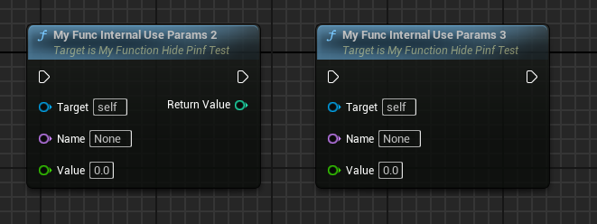

# InternalUseParam

- **功能描述：** 用在函数调用上，指定要隐藏的参数名称，也可以隐藏返回值。可以隐藏多个参数
- **使用位置：** UFUNCTION
- **引擎模块：** Pin
- **元数据类型：** strings="a，b，c"
- **关联项：** [HidePin](../HidePin/HidePin.md)
- **常用程度：** ★★

该元数据和HidePin是等价的。

## C++测试代码：

```cpp
UCLASS(Blueprintable, BlueprintType)
class INSIDER_API AMyFunction_HidePinfTest :public AActor
{
public:
	GENERATED_BODY()
public:
	UFUNCTION(BlueprintCallable)
	int MyFunc_Default(FName name, float value, FString options) { return 0; }

	UFUNCTION(BlueprintCallable, meta = (HidePin = "options"))
	int MyFunc_HidePin(FName name, float value, FString options) { return 0; }

	UFUNCTION(BlueprintCallable, meta = (InternalUseParam = "options,comment"))
	int MyFunc_HidePin2(FName name, float value, FString options,FString comment) { return 0; }

	UFUNCTION(BlueprintCallable, meta = (InternalUseParam = "options"))
	int MyFunc_InternalUseParam(FName name, float value, FString options) { return 0; }

	UFUNCTION(BlueprintCallable, meta = (HidePin = "ReturnValue"))
	int MyFunc_HideReturn(FName name, float value, FString options, FString& otherReturn) { return 0; }

public:
	UFUNCTION(BlueprintPure)
	int MyPure_Default(FName name, float value, FString options) { return 0; }

	UFUNCTION(BlueprintPure, meta = (HidePin = "options"))
	int MyPure_HidePin(FName name, float value, FString options) { return 0; }

	UFUNCTION(BlueprintPure, meta = (InternalUseParam = "options"))
	int MyPure_InternalUseParam(FName name, float value, FString options) { return 0; }

	UFUNCTION(BlueprintPure, meta = (HidePin = "ReturnValue"))
	int MyPure_HideReturn(FName name, float value, FString options, FString& otherReturn) { return 0; }

public:
	UFUNCTION(BlueprintCallable, meta = (InternalUseParam = "options,comment"))
	int MyFunc_InternalUseParams2(FName name, float value, FString options,FString comment) { return 0; }

	UFUNCTION(BlueprintCallable, meta = (InternalUseParam = "options,comment,ReturnValue"))
	int MyFunc_InternalUseParams3(FName name, float value, FString options,FString comment) { return 0; }

};
```

## 蓝图测试结果：



可以看出BlueprintCallable和BlueprintPure其实都可以。另外ReturnValue是默认的返回值的名字，也可以通过这个来隐藏掉。
## UE5.8 审计结论

UE5.8 源码中仍能找到该 metadata 的声明、示例或消费路径；本轮按 UE5.8 标记为已验证。该条目多属于插件、编辑器或内部工作流，使用前应先确认目标模块是否启用。

## 原理：

可见MD_InternalUseParam的使用也是在隐藏引脚。

```cpp
// Gets a list of pins that should hidden for a given function
void FBlueprintEditorUtils::GetHiddenPinsForFunction(UEdGraph const* Graph, UFunction const* Function, TSet<FName>& HiddenPins, TSet<FName>* OutInternalPins)
{
	check(Function != nullptr);
	TMap<FName, FString>* MetaData = UMetaData::GetMapForObject(Function);
	if (MetaData != nullptr)
	{
		for (TMap<FName, FString>::TConstIterator It(*MetaData); It; ++It)
		{
			const FName& Key = It.Key();

			if (Key == FBlueprintMetadata::MD_LatentInfo)
			{
				HiddenPins.Add(*It.Value());
			}
			else if (Key == FBlueprintMetadata::MD_HidePin)
			{
				TArray<FString> HiddenPinNames;
				It.Value().ParseIntoArray(HiddenPinNames, TEXT(","));
				for (FString& HiddenPinName : HiddenPinNames)
				{
					HiddenPinName.TrimStartAndEndInline();
					HiddenPins.Add(*HiddenPinName);
				}
			}
			else if (Key == FBlueprintMetadata::MD_ExpandEnumAsExecs ||
					Key == FBlueprintMetadata::MD_ExpandBoolAsExecs)
			{
				TArray<FName> EnumPinNames;
				UK2Node_CallFunction::GetExpandEnumPinNames(Function, EnumPinNames);

				for (const FName& EnumName : EnumPinNames)
				{
					HiddenPins.Add(EnumName);
				}
			}
			else if (Key == FBlueprintMetadata::MD_InternalUseParam)
			{
				TArray<FString> HiddenPinNames;
				It.Value().ParseIntoArray(HiddenPinNames, TEXT(","));
				for (FString& HiddenPinName : HiddenPinNames)
				{
					HiddenPinName.TrimStartAndEndInline();

					FName HiddenPinFName(*HiddenPinName);
					HiddenPins.Add(HiddenPinFName);

					if (OutInternalPins)
					{
						OutInternalPins->Add(HiddenPinFName);
					}
				}
			}
			else if (Key == FBlueprintMetadata::MD_WorldContext)
			{
				const UEdGraphSchema_K2* K2Schema = GetDefault<UEdGraphSchema_K2>();
				if(!K2Schema->IsStaticFunctionGraph(Graph))
				{
					bool bHasIntrinsicWorldContext = false;

					UBlueprint const* CallingContext = FindBlueprintForGraph(Graph);
					if (CallingContext && CallingContext->ParentClass)
					{
						UClass* NativeOwner = CallingContext->ParentClass;
						while(NativeOwner && !NativeOwner->IsNative())
						{
							NativeOwner = NativeOwner->GetSuperClass();
						}

						if(NativeOwner)
						{
							bHasIntrinsicWorldContext = NativeOwner->GetDefaultObject()->ImplementsGetWorld();
						}
					}

					// if the blueprint has world context that we can lookup with "self",
					// then we can hide this pin (and default it to self)
					if (bHasIntrinsicWorldContext)
					{
						HiddenPins.Add(*It.Value());
					}
				}
			}
		}
	}
}
```