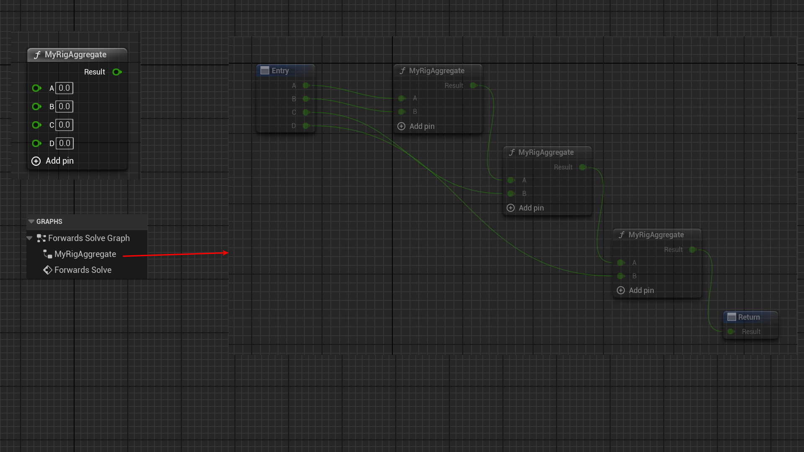

# Aggregate

- **功能描述：** 指定FRigUnit里的属性引脚为可扩展连续二元运算符的运算数。
- **使用位置：** UPROPERTY
- **引擎模块：** RigVMStruct
- **元数据类型：** bool
- **限制类型：** FRigUnit下的属性
- **常用程度：** ★★★

指定FRigUnit里的属性引脚为可扩展连续二元运算符的运算数。

记得在Input和Output上都加上Aggregate。
## UE5.8 审计结论

UE5.8 源码中仍能找到该 metadata 的声明、示例或消费路径；本轮按 UE5.8 标记为已验证。该条目多属于插件、编辑器或内部工作流，使用前应先确认目标模块是否启用。

## 测试代码：

```cpp
USTRUCT(meta = (DisplayName = "MyRigAggregate"))
struct INSIDER_API FRigUnit_MyRigAggregate : public FRigUnit
{
	GENERATED_BODY()

	RIGVM_METHOD()
		virtual void Execute() override;
public:
	UPROPERTY(meta = (Input,Aggregate))
	float A = 0.f;

	UPROPERTY(meta = (Input,Aggregate))
	float B= 0.f;

	UPROPERTY(meta = (Output,Aggregate))
	float Result = 0.f;
};
```

## 测试效果：

可见加了Aggregate之后，在蓝图节点上就可以继续动态AddPin。在左侧的Graph上也会创建中间MyRigAggregate节点。点开后，可以看见，其实就是继续组装原始的二元运算来达成继续AddPin的效果。



## 原理：

识别该Meta然后然后把引脚加到AggregateInputs和AggregateOutputs里。

```cpp
TArray<URigVMPin*> URigVMUnitNode::GetAggregateInputs() const
{
	TArray<URigVMPin*> AggregateInputs;
#if UE_RIGVM_AGGREGATE_NODES_ENABLED
	if (const UScriptStruct* Struct = GetScriptStruct())
	{
		for (URigVMPin* Pin : GetPins())
		{
			if (Pin->GetDirection() == ERigVMPinDirection::Input)
			{
				if (const FProperty* Property = Struct->FindPropertyByName(Pin->GetFName()))
				{
					if (Property->HasMetaData(FRigVMStruct::AggregateMetaName))
					{
						AggregateInputs.Add(Pin);
					}
				}
			}
		}
	}
	else
	{
		return Super::GetAggregateInputs();
	}
#endif
	return AggregateInputs;
}
```