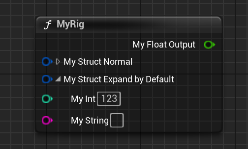

# ExpandByDefault

- **功能描述：** 把FRigUnit里的属性引脚默认展开。
- **使用位置：** UPROPERTY
- **引擎模块：** RigVMStruct
- **元数据类型：** bool
- **常用程度：** ★★★

把FRigUnit里的属性引脚默认展开。
## UE5.8 审计结论

UE5.8 源码中仍能找到该 metadata 的声明、示例或消费路径；本轮按 UE5.8 标记为已验证。该条目多属于插件、编辑器或内部工作流，使用前应先确认目标模块是否启用。

## 测试代码：

```cpp
USTRUCT(meta = (DisplayName = "MyRig"))
struct INSIDER_API FRigUnit_MyRig : public FRigUnit
{
	UPROPERTY(meta = (Input))
	FMyCommonStruct MyStruct_Normal;

	UPROPERTY(meta = (Input, ExpandByDefault))
	FMyCommonStruct MyStruct_ExpandByDefault;

		UPROPERTY(meta = (Output))
	float MyFloat_Output = 123.f;
｝
```

## 测试效果：

可见MyStruct_ExpandByDefault默认状态下就把该结构展开。



## 原理：

识别该Meta然后设定该引脚的bIsExpanded状态。

```cpp
FRigVMPinInfo::FRigVMPinInfo(FProperty* InProperty, ERigVMPinDirection InDirection, int32 InParentIndex, const uint8* InDefaultValueMemory)
{
	if (InProperty->HasMetaData(FRigVMStruct::ExpandPinByDefaultMetaName))
	{
		bIsExpanded = true;
	}
}
```