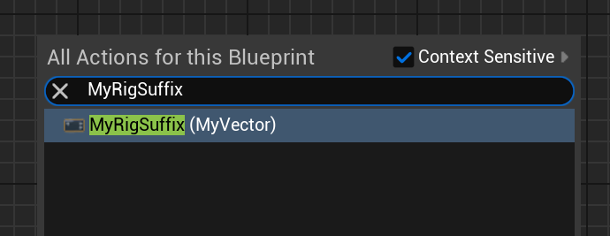

# MenuDescSuffix

- **功能描述：** 标识FRigUnit在蓝图右键菜单项的名字后缀。
- **使用位置：** USTRUCT
- **引擎模块：** RigVMStruct
- **元数据类型：** bool
- **限制类型：** FRigUnit类型上
- **常用程度：** ★★★

标识FRigUnit在蓝图右键菜单项的名字后缀。
## UE5.8 审计结论

UE5.8 源码中仍能找到该 metadata 的声明、示例或消费路径；本轮按 UE5.8 标记为已验证。该条目多属于插件、编辑器或内部工作流，使用前应先确认目标模块是否启用。

## 测试代码：

```cpp
USTRUCT(meta = (DisplayName = "MyRigSuffix", MenuDescSuffix = "(MyVector)"))
struct INSIDER_API FRigUnit_MyRigSuffix: public FRigUnit
{
	GENERATED_BODY()

	RIGVM_METHOD()
		virtual void Execute() override;
public:
	UPROPERTY(meta = (Input))
	float MyFloat_Input = 123.f;

	UPROPERTY(meta = (Output))
	float MyFloat_Output = 123.f;
};
```

## 测试效果：

可见出现了"(MyVector)"的后缀。



## 原理：

得到该数据，然后添加到DisplayName后面。

```cpp
FString CategoryMetadata, DisplayNameMetadata, MenuDescSuffixMetadata;
Struct->GetStringMetaDataHierarchical(FRigVMStruct::CategoryMetaName, &CategoryMetadata);
Struct->GetStringMetaDataHierarchical(FRigVMStruct::DisplayNameMetaName, &DisplayNameMetadata);
Struct->GetStringMetaDataHierarchical(FRigVMStruct::MenuDescSuffixMetaName, &MenuDescSuffixMetadata);

if(DisplayNameMetadata.IsEmpty())
{
	DisplayNameMetadata = Struct->GetDisplayNameText().ToString();
}
if (!MenuDescSuffixMetadata.IsEmpty())
{
	MenuDescSuffixMetadata = TEXT(" ") + MenuDescSuffixMetadata;
}

FText MenuDesc = FText::FromString(DisplayNameMetadata + MenuDescSuffixMetadata);
```