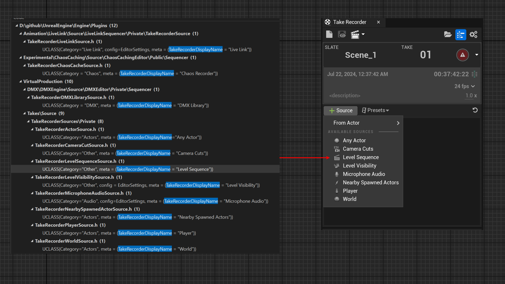

# TakeRecorderDisplayName

- **功能描述：** 指定UTakeRecorderSource的显示名字。
- **使用位置：** UCLASS
- **引擎模块：** Sequencer
- **元数据类型：** string="abc"
- **限制类型：** UTakeRecorderSource的子类上
- **常用程度：** ★★

指定UTakeRecorderSource的显示名字。

这个一般是引擎内部自己用，除非想自己自定义UTakeRecorderSource才会派上用场。因为原理和展示过于简单，因此就不自己构建测试代码。
## UE5.8 审计结论

本机 UE5.8 Take Recorder 源码未检索到 `TakeRecorderDisplayName` metadata 读取路径；相关源类改为返回本地化显示文本。本轮按 `changed_in_version` 记录，不建议继续把它作为 UE5.8 可用 metadata 路由。

## 源码例子：

```cpp
UCLASS(Category="Actors", meta = (TakeRecorderDisplayName = "Player"))
class UTakeRecorderPlayerSource : public UTakeRecorderSource
{}
```

## 测试效果：

在引擎源码中可见有多个UTakeRecorderSource，其上都标了名字。



## 原理：

用TakeRecorderDisplayName指定的名字来作为菜单项的名字。

```cpp
TSharedRef<SWidget> SLevelSequenceTakeEditor::OnGenerateSourcesMenu()
{
		for (UClass* Class : SourceClasses)
		{
			TSubclassOf<UTakeRecorderSource> SubclassOf = Class;

			MenuBuilder.AddMenuEntry(
				FText::FromString(Class->GetMetaData(TEXT("TakeRecorderDisplayName"))),
				Class->GetToolTipText(true),
				FSlateIconFinder::FindIconForClass(Class),
				FUIAction(
					FExecuteAction::CreateSP(this, &SLevelSequenceTakeEditor::AddSourceFromClass, SubclassOf),
					FCanExecuteAction::CreateSP(this, &SLevelSequenceTakeEditor::CanAddSourceFromClass, SubclassOf)
				)
			);
		}
}
```