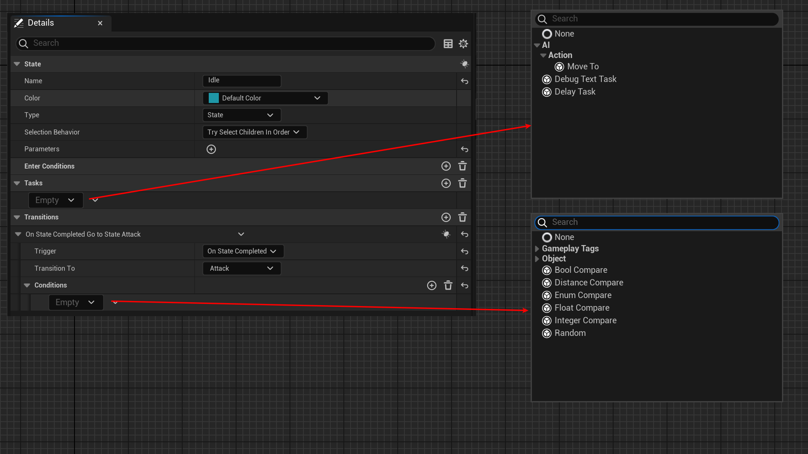

# BaseClass

- **功能描述：** 只在StateTree模块中使用，限制FStateTreeEditorNode选择的基类类型。
- **使用位置：** UPROPERTY
- **引擎模块：** TypePicker
- **元数据类型：** bool
- **限制类型：** FStateTreeEditorNode属性
- **常用程度：** ★

只在StateTree模块中使用，限制FStateTreeEditorNode选择的基类类型。

## 源码例子：

```cpp

USTRUCT()
struct STATETREEEDITORMODULE_API FStateTreeTransition
{
	/** Conditions that must pass so that the transition can be triggered. */
	UPROPERTY(EditDefaultsOnly, Category = "Transition", meta = (BaseStruct = "/Script/StateTreeModule.StateTreeConditionBase", BaseClass = "/Script/StateTreeModule.StateTreeConditionBlueprintBase"))
	TArray<FStateTreeEditorNode> Conditions;

	UPROPERTY(EditDefaultsOnly, Category = "Tasks", meta = (BaseStruct = "/Script/StateTreeModule.StateTreeTaskBase", BaseClass = "/Script/StateTreeModule.StateTreeTaskBlueprintBase"))
	TArray<FStateTreeEditorNode> Tasks;
}
```

## 测试结果：

可见，虽然Conditions和Tasks的类型都是FStateTreeEditorNode，但是选项列表里的内容是不同的。这是由于其上面的BaseStruct和BaseClass 不同，分别限定了结构的基类类型以及蓝图类的基类。


## UE5.8 审计结论

UE5.8 源码中仍能找到该 metadata 的声明、示例或消费路径；本轮按 UE5.8 标记为已验证。

## 原理：

在FStateTreeEditorNode的UI定制化上获取该属性，然后用来过滤可用的节点类型。

```cpp
void FStateTreeEditorNodeDetails::CustomizeHeader(TSharedRef<class IPropertyHandle> StructPropertyHandle, class FDetailWidgetRow& HeaderRow, IPropertyTypeCustomizationUtils& StructCustomizationUtils)
{
		static const FName BaseClassMetaName(TEXT("BaseClass")); // TODO: move these names into one central place.
		const FString BaseClassName = StructProperty->GetMetaData(BaseClassMetaName);
		BaseClass = UClass::TryFindTypeSlow<UClass>(BaseClassName);
}

```