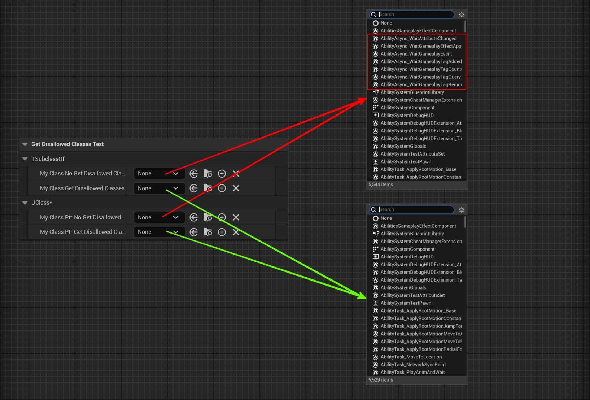

# GetDisallowedClasses

- **功能描述：** 用在类选择器上，通过一个函数来指定选择的类型列表中排除掉某一些类型基类。
- **使用位置：** UPROPERTY
- **引擎模块：** TypePicker
- **元数据类型：** string="abc"
- **限制类型：** TSubClassOf，UClass*
Code: TArray<UClass*> FuncName() const;
- **关联项：** [AllowedClasses](../AllowedClasses/AllowedClasses.md)
- **常用程度：** ★★

大体和GetAllowedClasses相同，只是相反的作用。

但作用的属性类型和DisallowedClasses相似，只能作用在类选择器上。因此经过测试下来，只能作用在TSubClassOf，UClass*。

## 测试代码：

```cpp
UFUNCTION()
TArray<UClass*> MyGetDisallowedClassesFunc()
{
	TArray<UClass*> classes;
	classes.Add(UAbilityAsync::StaticClass());
	classes.Add(UTexture2D::StaticClass());
	return classes;
}


UPROPERTY(EditAnywhere, BlueprintReadWrite, Category = "GetDisallowedClassesTest|TSubclassOf")
TSubclassOf<UObject> MyClass_NoGetDisallowedClasses;

UPROPERTY(EditAnywhere, BlueprintReadWrite, Category = "GetDisallowedClassesTest|TSubclassOf", meta = (GetDisallowedClasses = "MyGetDisallowedClassesFunc"))
TSubclassOf<UObject> MyClass_GetDisallowedClasses;

UPROPERTY(EditAnywhere, BlueprintReadWrite, Category = "GetDisallowedClassesTest|UClass*")
UClass* MyClassPtr_NoGetDisallowedClasses;

UPROPERTY(EditAnywhere, BlueprintReadWrite, Category = "GetDisallowedClassesTest|UClass*", meta = (GetDisallowedClasses = "MyGetDisallowedClassesFunc"))
UClass* MyClassPtr_GetDisallowedClasses;
```

## 测试效果：

可以发现加了GetDisallowedClasses之后，选择列表上少了一些类型。



## 原理：

虽然SPropertyEditorClass和SPropertyEditorAsset都用上了GetAllowedAndDisallowedClasses，因此可以利用GetDisallowedClasses。但是SPropertyEditorAsset后面是用的SAssetPicker，它里面不会用DisallowedClasses，因此实际上SPropertyEditorAsset是不支持GetDisallowedClasses的，因此UObject*类型的属性不支持GetDisallowedClasses。

```cpp
void SPropertyEditorAsset::InitializeClassFilters(const FProperty* Property)
{
		PropertyEditorUtils::GetAllowedAndDisallowedClasses(ObjectList, *MetadataProperty, AllowedClassFilters, DisallowedClassFilters, bExactClass, ObjectClass);
}

void SPropertyEditorClass::Construct(const FArguments& InArgs, const TSharedPtr< FPropertyEditor >& InPropertyEditor)
{
		PropertyEditorUtils::GetAllowedAndDisallowedClasses(ObjectList, *Property, AllowedClassFilters, DisallowedClassFilters, false);
}

TSharedRef<SWidget> SPropertyEditorEditInline::GenerateClassPicker()
{
		PropertyEditorUtils::GetAllowedAndDisallowedClasses(ObjectList, *Property, AllowedClassFilters, DisallowedClassFilters, false);
}

void PropertyEditorUtils::GetAllowedAndDisallowedClasses(const TArray<UObject*>& ObjectList, const FProperty& MetadataProperty, TArray<const UClass*>& AllowedClasses, TArray<const UClass*>& DisallowedClasses, bool bExactClass, const UClass* ObjectClass)
{
	AllowedClasses = PropertyCustomizationHelpers::GetClassesFromMetadataString(MetadataProperty.GetOwnerProperty()->GetMetaData("AllowedClasses"));
	DisallowedClasses = PropertyCustomizationHelpers::GetClassesFromMetadataString(MetadataProperty.GetOwnerProperty()->GetMetaData("DisallowedClasses"));

	bool bMergeAllowedClasses = !AllowedClasses.IsEmpty();

	if (MetadataProperty.GetOwnerProperty()->HasMetaData("GetAllowedClasses"))
	{
		const FString GetAllowedClassesFunctionName = MetadataProperty.GetOwnerProperty()->GetMetaData("GetAllowedClasses");
	}

	if (MetadataProperty.GetOwnerProperty()->HasMetaData("GetDisallowedClasses"))
	{
		const FString GetDisallowedClassesFunctionName = MetadataProperty.GetOwnerProperty()->GetMetaData("GetDisallowedClasses");
		if (!GetDisallowedClassesFunctionName.IsEmpty())
		{
			for (UObject* Object : ObjectList)
			{
				const UFunction* GetDisallowedClassesFunction = Object ? Object->FindFunction(*GetDisallowedClassesFunctionName) : nullptr;
				if (GetDisallowedClassesFunction)
				{
					DECLARE_DELEGATE_RetVal(TArray<UClass*>, FGetDisallowedClasses);
					DisallowedClasses.Append(FGetDisallowedClasses::CreateUFunction(Object, GetDisallowedClassesFunction->GetFName()).Execute());
				}
			}
		}
	}
}
```