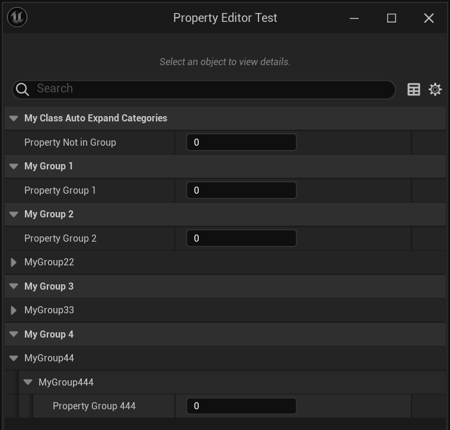

# AutoCollapseCategories

- **功能描述：**  AutoCollapseCategories说明符使父类上的 AutoExpandCategories 说明符的列出类别的效果无效。
- **引擎模块：** Category
- **元数据类型：** strings=(abc，"d|e"，"x|y|z")
- **作用机制：** 在Meta中增加[AutoCollapseCategories](../../../../Meta/DetailsPanel/AutoCollapseCategories.md)，去除[AutoExpandCategories](../../../../Meta/DetailsPanel/AutoExpandCategories.md)
- **关联项：** [DontAutoCollapseCategories](../DontAutoCollapseCategories.md)、[AutoExpandCategories](../AutoExpandCategories/AutoExpandCategories.md)
- **常用程度：★**

## 示例代码：

```cpp
UCLASS(Blueprintable, AutoCollapseCategories = ("MyGroup2|MyGroup22"))
class INSIDER_API UMyClass_AutoCollapseCategories :public UMyClass_AutoExpandCategories
{
	GENERATED_BODY()
public:
};
```

## 示例结果：

关闭了Group22的展开，但是444的展开依然继承了



## 行为

UE5.8 UHT 把指定分类加入 `AutoCollapseCategories`，并从 `AutoExpandCategories` 移除同名分类。

## UE5.8 审计结论

- 状态：`verified_UE5.8`。
- 结论：已按 UE5.8 源码验证。
- 证据：
  - UE5.8 `UhtClassSpecifiers.cs` class specifier branch
  - UE5.8 `UhtClass.cs` class flag/metadata resolution and validation

## 常见误用

把 class specifier 的 metadata/flag 结果和 property/function specifier 混淆；或忽略继承/撤销类 specifier 的相互作用。
