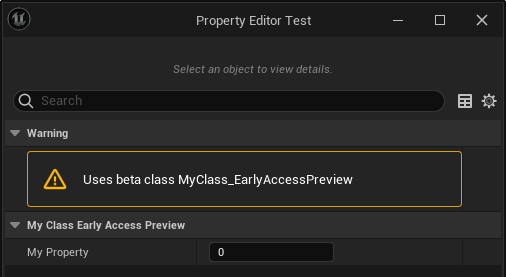

# EarlyAccessPreview

- **功能描述：**  标明该类是早期预览版，比试验版要更完善一些，但还是没到产品级。
- **引擎模块：** Development
- **元数据类型：** bool
- **作用机制：** 在Meta中添加[DevelopmentStatus](../../../../Meta/Development/DevelopmentStatus.md)，将类标记为EarlyAccess
- **常用程度：★★★**

标明该类是早期预览版，比试验版要更完善一些，但还是没到产品级。

这个标记会在类的元数据上加上{ "DevelopmentStatus", "EarlyAccess" }。

## 示例代码：

```cpp
//(BlueprintType = true, DevelopmentStatus = EarlyAccess, IncludePath = Class/Display/MyClass_Deprecated.h, IsBlueprintBase = true, ModuleRelativePath = Class/Display/MyClass_Deprecated.h)
UCLASS(Blueprintable, EarlyAccessPreview)
class INSIDER_API UMyClass_EarlyAccessPreview :public UObject
{
	GENERATED_BODY()
public:
	UPROPERTY(EditAnywhere, BlueprintReadWrite)
		int32 MyProperty;
	UFUNCTION(BlueprintCallable)
		void MyFunc() {}
};
```

## 示例结果：


## UE5.8 审计结论

UE5.8 UHT 或宏路径仍保留该条目；本轮按 UE5.8 标记为已验证。P3 中不少条目属于引擎内部、NoExportTypes 或插件专用用法，不建议普通项目代码直接套用。
