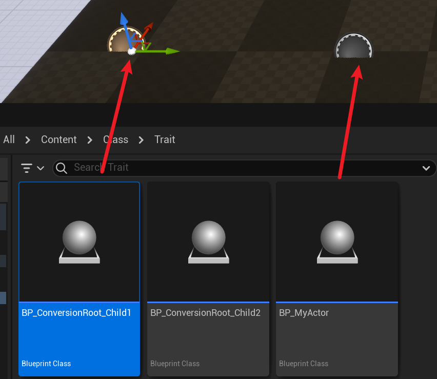

# ConversionRoot

- **功能描述：**  在场景编辑器里允许Actor在自身以及子类之间做转换
- **引擎模块：** Scene
- **元数据类型：** bool
- **作用机制：** 在Meta中增加[IsConversionRoot](../../../../Meta/Blueprint/IsConversionRoot.md)
- **常用程度：★**

一般是用在Actor上，在Actor转换的时候用来限制转换的级别。比如ASkeletalMeshActor，AStaticMeshActor等。

常常ComponentWrapperClass一起出现。

根据代码来说，meta中的IsConversionRoot会限制只传达到这一层，不继续往根上查找。

只有配有ConversionRoot的Actor才会允许Convert Actor，否则是禁用的。

## 示例代码：

```cpp
//(BlueprintType = true, IncludePath = Class/Trait/MyClass_ConversionRoot.h, IsBlueprintBase = true, IsConversionRoot = true, ModuleRelativePath = Class/Trait/MyClass_ConversionRoot.h)
UCLASS(Blueprintable,BlueprintType, ConversionRoot)
class INSIDER_API AMyActor_ConversionRoot :public AActor
{
	GENERATED_BODY()
};

```

## 示例效果：

在蓝图中创建其子类BP_ConversionRoot_Child1和BP_ConversionRoot_Child2。然后把BP_ConversionRoot_Child1拖放进场景里创建个Actor，也创建个普通的蓝图Actor作为对比。



在关卡中选择Child1，会允许ConvertActor，在ConverstionRoot的自身以及所有子类之间做转换。


如果是普通的Actor，因为没有定义ConversionRoot，则不能做转换。


## 原理：

在关卡中的Actor选择：关卡中选择一个Actor，然后DetailsPanel里会显示ConverActor属性栏，可以选择另外一个Actor来进行改变。
TSharedRef<SWidget> FActorDetails::MakeConvertMenu( const FSelectedActorInfo& SelectedActorInfo )
这个函数就是用来创建Select Type的Combo Button的菜单的。内部会调用CreateClassPickerConvertActorFilter：

```cpp
UClass* FActorDetails::GetConversionRoot( UClass* InCurrentClass ) const
{
	UClass* ParentClass = InCurrentClass;

	while(ParentClass)
	{
		if( ParentClass->GetBoolMetaData(FName(TEXT("IsConversionRoot"))) )
		{
			break;
		}
		ParentClass = ParentClass->GetSuperClass();
	}

	return ParentClass;
}

void FActorDetails::CreateClassPickerConvertActorFilter(const TWeakObjectPtr<AActor> ConvertActor, class FClassViewerInitializationOptions* ClassPickerOptions)
Filter->AllowedChildOfRelationship.Add(RootConversionClass);//限定这个基类以下的其他子类

```

## 行为

UE5.8 UHT 写入 `IsConversionRoot=true` metadata，用于 Blueprint 类型转换根标记。

## UE5.8 审计结论

- 状态：`verified_UE5.8`。
- 结论：已按 UE5.8 源码验证。
- 证据：
  - UE5.8 `UhtClassSpecifiers.cs` class specifier branch
  - UE5.8 `UhtClass.cs` class flag/metadata resolution and validation

## 常见误用

把 class specifier 的 metadata/flag 结果和 property/function specifier 混淆；或忽略继承/撤销类 specifier 的相互作用。
