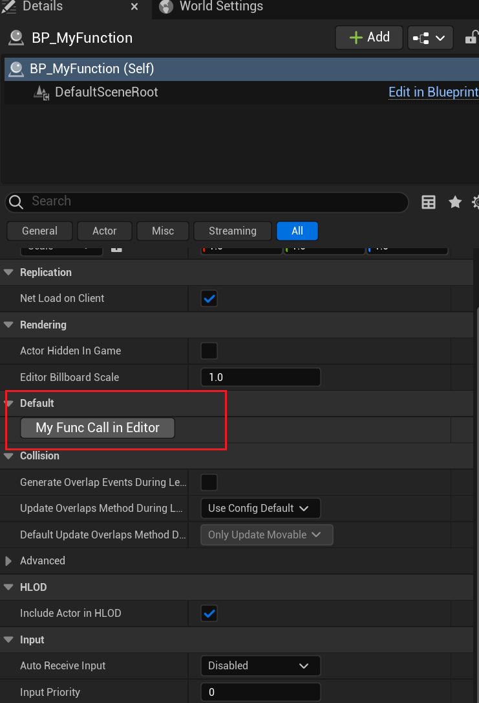

# CallInEditor

- **功能描述：** 可以在属性细节面板上作为一个按钮来调用该函数。

- **元数据类型：** bool
- **引擎模块：** Editor
- **作用机制：** 在Meta中增加[CallInEditor](../../../../Meta/Blueprint/CallInEditor.md)
- **常用程度：** ★★★★★

可以在属性细节面板上作为一个按钮来调用该函数。

该函数写在AActor或UObject子类里都是可以的，只要有对应的属性细节面板。

注意这一般是处于Editor运行环境的。典型的例子是ASkyLight的Recapture按钮。因此函数里有时会调用编辑器环境下函数。但也要注意不要在runtime下混用了，比较容易出错。

## 行为

`CallInEditor` 让函数可以在 Details Panel 中显示为可点击按钮，用于编辑器内对选中对象执行操作。普通路径下函数需要无参数；PropertyEditor 也有针对 editor utility function library 的 world context 特例。

## UE5.8 审计结论

在 UE5.8 UHT 源码 `UhtDefaultSpecifiers.cs` 中，`CallInEditorSpecifier` 写入 `CallInEditor=true` metadata，而不是设置 FunctionFlags。UE5.8 PropertyEditor 的 `GetCallInEditorFunctionsForClassInternal` 会筛选带该 metadata 且 `ParmsSize == 0` 的函数，再通过 `AddFunctionCallWidgets` 添加到 Details Panel。Hello 样例 `Function/MyFunction_Default.h` 中 `MyFunc_CallInEditor` 的 metadata 包含 `CallInEditor = true`。

## 常见误用

- `CallInEditor` 不是运行时按钮；它服务于编辑器 Details Panel。
- 普通成员函数不要带业务参数，否则不会走常规 CallInEditor 按钮筛选。
- 如果函数修改对象或关卡状态，应考虑事务、对象 dirty 状态和编辑器世界上下文。

## 测试代码：

```cpp
UCLASS(Blueprintable, BlueprintType)
class INSIDER_API AMyFunction_Default :public AActor
{
public:
	GENERATED_BODY()
public:
	UFUNCTION(CallInEditor)
	void MyFunc_CallInEditor(){}
};
```

## 蓝图展示：


