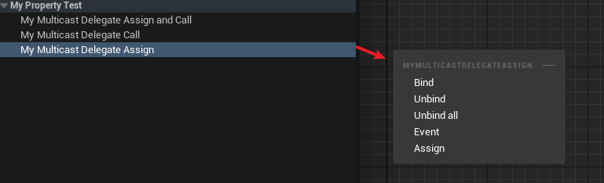

# BlueprintAssignable

- **功能描述：** 在蓝图中可以为这个多播委托绑定事件

- **元数据类型：** bool
- **引擎模块：** Blueprint
- **限制类型：** Multicast Delegates
- **作用机制：** 在PropertyFlags中加入CPF_BlueprintAssignable
- **常用程度：** ★★★

## C++的测试代码：

```cpp
DECLARE_DYNAMIC_MULTICAST_DELEGATE_OneParam(FMyDynamicMulticastDelegate_One, int32, Value);

UPROPERTY(EditAnywhere, BlueprintReadWrite, BlueprintAssignable, BlueprintCallable)
	FMyDynamicMulticastDelegate_One MyMulticastDelegateAssignAndCall;

UPROPERTY(EditAnywhere, BlueprintReadWrite, BlueprintCallable)
	FMyDynamicMulticastDelegate_One MyMulticastDelegateCall;

UPROPERTY(EditAnywhere, BlueprintReadWrite, BlueprintAssignable)
	FMyDynamicMulticastDelegate_One MyMulticastDelegateAssign;

UPROPERTY(EditAnywhere, BlueprintReadWrite)
	FMyDynamicMulticastDelegate_One MyMulticastDelegate;

```

## 蓝图中的表现：



因此一般建议二者标记都加上：


## 行为

在 UE5.8 UHT 中写入 `CPF_BlueprintAssignable`，主要用于让 Blueprint 绑定 multicast delegate 属性。

## UE5.8 审计结论

- 状态：`verified_UE5.8`。
- 结论：已按 UE5.8 源码验证。
- 证据：
  - UE5.8 `UhtPropertyMemberSpecifiers.cs` 对应 specifier 分支

## 常见误用

用于普通数值属性；或以为它会自动提供调用权限。
