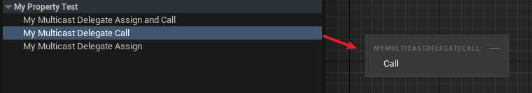

# BlueprintCallable

- **功能描述：** 在蓝图中可以调用这个多播委托

- **元数据类型：** bool
- **引擎模块：** Blueprint
- **限制类型：** Multicast Delegates
- **作用机制：** 在PropertyFlags中加入CPF_BlueprintCallable
- **常用程度：** ★★★

在蓝图中可以调用这个多播委托。

## 示例代码：

```cpp
DECLARE_DYNAMIC_MULTICAST_DELEGATE_OneParam(FMyDynamicMulticastDelegate_One, int32, Value);

UPROPERTY(EditAnywhere, BlueprintReadWrite, BlueprintAssignable, BlueprintCallable)
	FMyDynamicMulticastDelegate_One MyMulticastDelegateAssignAndCall;

UPROPERTY(EditAnywhere, BlueprintReadWrite, BlueprintCallable)
	FMyDynamicMulticastDelegate_One MyMulticastDelegateCall;

UPROPERTY(EditAnywhere, BlueprintReadWrite, BlueprintAssignable)
	FMyDynamicMulticastDelegate_One MyMulticastDelegateAssign;

UPROPERTY(EditAnywhere, BlueprintReadWrite)
	FMyDynamicMulticastDelegate_One MyMulticastDelegate;
```

## 示例效果：



注意BlueprintAssignable和BlueprintCallable只能用于多播委托：

```cpp
DECLARE_DYNAMIC_DELEGATE_OneParam(FMyDynamicSinglecastDelegate_One, int32, Value);

//编译报错：'BlueprintCallable' is only allowed on a property when it is a multicast delegate
UPROPERTY(EditAnywhere, BlueprintReadWrite, BlueprintCallable)
	FMyDynamicSinglecastDelegate_One MyMyDelegate4;

	//编译报错：'BlueprintAssignable' is only allowed on a property when it is a multicast delegate
UPROPERTY(EditAnywhere, BlueprintReadWrite, BlueprintAssignable)
	FMyDynamicSinglecastDelegate_One MyMyDelegate5;
```

## 行为

在 UE5.8 UHT 中写入 `CPF_BlueprintCallable`，主要用于让 Blueprint 调用 delegate 属性。

## UE5.8 审计结论

- 状态：`verified_UE5.8`。
- 结论：已按 UE5.8 源码验证。
- 证据：
  - UE5.8 `UhtPropertyMemberSpecifiers.cs` 对应 specifier 分支

## 常见误用

用于普通字段并期待生成函数节点；或和 `BlueprintAssignable` 的绑定语义混淆。
