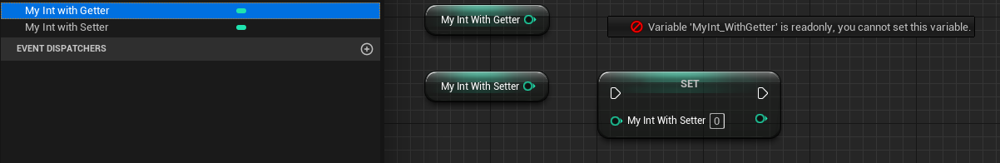

# BlueprintSetter

- **功能描述：** 采用一个自定义的set函数来读取。

- **元数据类型：** string="abc"
- **引擎模块：** Blueprint
- **作用机制：** 在PropertyFlags中加入[CPF_BlueprintVisible](../../../Flags/EPropertyFlags/CPF_BlueprintVisible.md)，在Meta中加入[BlueprintSetter](../../../Meta/Blueprint/BlueprintSetter.md)
- **常用程度：** ★★★

采用一个自定义的set函数来读取。

会默认设置BlueprintReadWrite。

## 测试代码：

```cpp
public:
	//(BlueprintGetter = , Category = Blueprint, ModuleRelativePath = Property/MyProperty_Test.h)
	UFUNCTION(BlueprintGetter, Category = Blueprint)	//or BlueprintPure
		int32 MyInt_Getter()const { return MyInt_WithGetter * 2; }

	//(BlueprintSetter = , Category = Blueprint, ModuleRelativePath = Property/MyProperty_Test.h)
	UFUNCTION(BlueprintSetter, Category = Blueprint)	//or BlueprintCallable
		void MyInt_Setter(int NewValue) { MyInt_WithSetter = NewValue / 4; }
private:
	//(BlueprintGetter = MyInt_Getter, Category = Blueprint, ModuleRelativePath = Property/MyProperty_Test.h)
	//PropertyFlags:	CPF_BlueprintVisible | CPF_BlueprintReadOnly | CPF_ZeroConstructor | CPF_IsPlainOldData | CPF_NoDestructor | CPF_HasGetValueTypeHash | CPF_NativeAccessSpecifierPrivate
	UPROPERTY(BlueprintGetter = MyInt_Getter, Category = Blueprint)
		int32 MyInt_WithGetter = 123;

	//(BlueprintSetter = MyInt_Setter, Category = Blueprint, ModuleRelativePath = Property/MyProperty_Test.h)
	//PropertyFlags:	CPF_BlueprintVisible | CPF_ZeroConstructor | CPF_IsPlainOldData | CPF_NoDestructor | CPF_HasGetValueTypeHash | CPF_NativeAccessSpecifierPrivate
	UPROPERTY(BlueprintSetter = MyInt_Setter, Category = Blueprint)
		int32 MyInt_WithSetter = 123;
```

## 蓝图表现：



## 原理：

如果有MD_PropertySetFunction则用它来作为Set的调用。

```cpp
void UK2Node_VariableSet::ExpandNode(class FKismetCompilerContext& CompilerContext, UEdGraph* SourceGraph)
{
		// If property has a BlueprintSetter accessor, then replace the variable get node with a call function
		if (VariableProperty)
		{
			// todo check with BP team if we need to test if the variable has native Setter
			const FString& SetFunctionName = VariableProperty->GetMetaData(FBlueprintMetadata::MD_PropertySetFunction);
			if (!SetFunctionName.IsEmpty())
			{
			}
		}
}
```