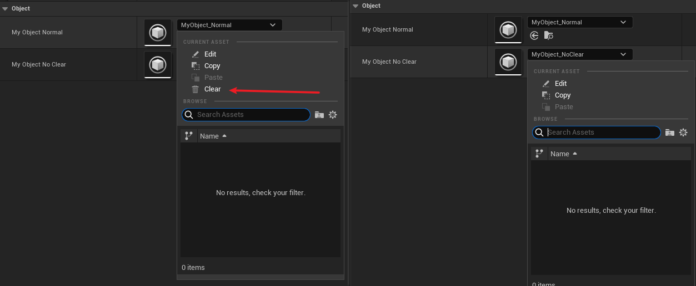

# NoClear

- **功能描述：** 指定该属性的编辑选项中不出现Clear按钮，不允许置null。

- **元数据类型：** bool
- **引擎模块：** DetailsPanel, Editor
- **限制类型：** 引用类型
- **作用机制：** 在PropertyFlags中加入[CPF_NoClear](../../../../Flags/EPropertyFlags/CPF_NoClear.md)
- **常用程度：** ★★★

指定该属性的编辑选项中不出现Clear按钮。

作用是阻止用户在编辑器面板上将此Object引用设为null。但其实也可用在其他表示一个引用类型的结构上，比如FPrimaryAssetId，FInstancedStruct，FDataRegistryType等。

## 示例代码：

```cpp
UPROPERTY(EditAnywhere, Category = Object)
class UMyClass_Default* MyObject_Normal;
//PropertyFlags:	CPF_Edit | CPF_ZeroConstructor | CPF_NoClear | CPF_NoDestructor | CPF_HasGetValueTypeHash | CPF_NativeAccessSpecifierPublic
UPROPERTY(EditAnywhere, NoClear, Category = Object)
class UMyClass_Default* MyObject_NoClear;

//构造函数赋值：
MyObject_Normal = CreateDefaultSubobject<UMyClass_Default>("MyObject_Normal");
MyObject_NoClear = CreateDefaultSubobject<UMyClass_Default>("MyObject_NoClear");
```

## 示例效果：



## 原理：

CPF_NoClear在引擎里有挺多使用。

```cpp
	const bool bAllowClear = !StructPropertyHandle->GetMetaDataProperty()->HasAnyPropertyFlags(CPF_NoClear);

```