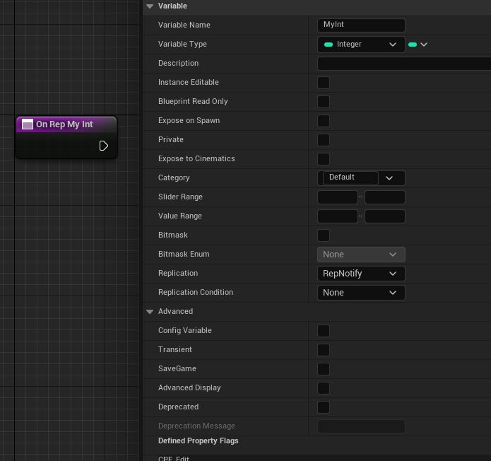

# ReplicatedUsing

- **功能描述：** 指定一个通知回调函数，在属性通过网络更新后执行。
- **元数据类型：** string="abc"
- **引擎模块：** Network
- **作用机制：** 在PropertyFlags中加入CPF_Net, CPF_RepNotify
- **常用程度：** ★★★★★

ReplicatedUsing 可以接受无参数的函数，或是带一个参数的函数携带旧值。一般在OnRep函数里，做一些开启关闭的相应操作，比如enabled的复制就会触发相应的后续逻辑。

## 行为

`ReplicatedUsing=FunctionName` 把属性标为网络复制属性，并指定客户端收到复制更新后的 RepNotify 回调。运行时是否复制仍依赖 Actor/component 的复制开关、网络角色、`GetLifetimeReplicatedProps` 中的 lifetime 注册以及复制条件。

## UE5.8 审计结论

在 UE5.8 UHT 源码 `UhtPropertyMemberSpecifiers.cs` 中，`ReplicatedUsingSpecifier` 会设置 `EPropertyFlags.Net`，记录 `RepNotifyName`，并设置 `EPropertyFlags.RepNotify`。UHT 还会拒绝结构体成员复制，并要求提供非空的通知函数名。Hello 样例 `Property/Network/MyProperty_Network.h` 使用 `DOREPLIFETIME` 注册该属性。

## 常见误用

- 只写 `ReplicatedUsing` 不会自动完成复制注册；仍要在 `GetLifetimeReplicatedProps` 中添加对应 `DOREPLIFETIME` 或条件注册。
- OnRep 回调主要在接收端复制更新时触发，不应把它当成服务器本地赋值后的通用 setter。
- 回调函数名必须有效，并且签名要符合 UE RepNotify 支持的形式。

## 测试代码：

```jsx
UCLASS(Blueprintable, BlueprintType)
class INSIDER_API AMyProperty_Network :public AActor
{
public:
	GENERATED_BODY()
protected:
	UFUNCTION()
		void OnRep_MyInt(int32 oldValue);
UPROPERTY(EditAnywhere, BlueprintReadWrite, ReplicatedUsing = OnRep_MyInt)
		int32 MyInt_ReplicatedUsing = 123;
};

void AMyProperty_Network::GetLifetimeReplicatedProps(TArray<FLifetimeProperty>& OutLifetimeProps) const
{
	Super::GetLifetimeReplicatedProps(OutLifetimeProps);
	DOREPLIFETIME(AMyProperty_Network, MyInt_ReplicatedUsing);
}
```

在蓝图中等价于RepNotify的作用。


