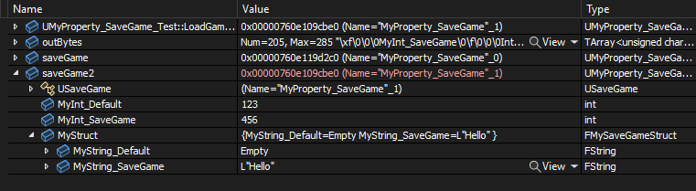

# SaveGame

- **功能描述：** 在SaveGame存档的时候，只序列化有SaveGame标记的属性，而不序列化别的属性。
- **元数据类型：** bool
- **引擎模块：** Serialization
- **常用程度：** ★★★★★

在SaveGame存档的时候，只序列化有SaveGame标记的属性，而不序列化别的属性。

特别的标识哪些属性是用于存档保存的。

对于子结构或子对象属性，也必须要加上SaveGame标记。

NoExportTypes.h里的很多基础结构内部属性都被标上了SaveGame。

## 行为

`SaveGame` 标记属性在 SaveGame archive 中参与序列化。只有当 archive 的 `ArIsSaveGame` 为 true 时，这个筛选才生效；它不会自动保存对象到磁盘，也不会自动保存所有 Actor 状态。

## UE5.8 审计结论

在 UE5.8 UHT 源码 `UhtPropertyMemberSpecifiers.cs` 中，`SaveGameSpecifier` 会设置 `EPropertyFlags.SaveGame`。在 `CoreUObject` 的 `FProperty::ShouldSerializeValue` 中，如果 `Ar.IsSaveGame()` 为 true，未带 `CPF_SaveGame` 的属性会被跳过。Hello 样例 `Property/Serialization/MyProperty_SaveGame.h/.cpp` 使用 `FObjectAndNameAsStringProxyArchive` 并手动设置 `Ar.ArIsSaveGame = true` 来验证该路径。

## 常见误用

- `USaveGame` 类本身不代表所有属性都会保存；未标 `SaveGame` 的属性会在 SaveGame archive 下被跳过。
- 结构体或子对象内部需要保存的字段也要各自标记 `SaveGame`。
- `SaveGame` 不替代 `Transient`、`Config`、复制或手动持久化逻辑；它只是序列化筛选标记。

## 测试代码：

```cpp
struct FMySaveGameArchive : public FObjectAndNameAsStringProxyArchive
{
    FMySaveGameArchive (FArchive& InInnerArchive)
        :   FObjectAndNameAsStringProxyArchive(InInnerArchive)
    {
        ArIsSaveGame = true;
    }
};

USTRUCT(BlueprintType)
struct FMySaveGameStruct
{
	GENERATED_BODY()
public:
	UPROPERTY(EditAnywhere, BlueprintReadWrite)
		FString MyString_Default;
	UPROPERTY(EditAnywhere, BlueprintReadWrite,SaveGame)
		FString MyString_SaveGame;
};

UCLASS(Blueprintable, BlueprintType)
class INSIDER_API UMyProperty_SaveGame :public USaveGame
{
public:
	GENERATED_BODY()
public:
	UPROPERTY(EditAnywhere, BlueprintReadWrite)
		int32 MyInt_Default = 123;
	//PropertyFlags:	CPF_Edit | CPF_BlueprintVisible | CPF_ZeroConstructor | CPF_SaveGame | CPF_IsPlainOldData | CPF_NoDestructor | CPF_HasGetValueTypeHash | CPF_NativeAccessSpecifierPublic
	UPROPERTY(EditAnywhere, BlueprintReadWrite, SaveGame)
		int32 MyInt_SaveGame = 123;
	UPROPERTY(EditAnywhere, BlueprintReadWrite,SaveGame)
		FMySaveGameStruct MyStruct;
};

UMyProperty_SaveGame* UMyProperty_SaveGame_Test::LoadGameFromMemory(const TArray<uint8>& InSaveData)
{
	FMemoryReader MemoryReader(InSaveData, true);

	FObjectAndNameAsStringProxyArchive Ar(MemoryReader, true);
		Ar.ArIsSaveGame = true;//必须手动加上这个标记

	UMyProperty_SaveGame* OutSaveGameObject = NewObject<UMyProperty_SaveGame>(GetTransientPackage(), UMyProperty_SaveGame::StaticClass());
	OutSaveGameObject->Serialize(Ar);

	return OutSaveGameObject;
}

bool UMyProperty_SaveGame_Test::SaveGameToMemory(UMyProperty_SaveGame* SaveGameObject, TArray<uint8>& OutSaveData)
{
	FMemoryWriter MemoryWriter(OutSaveData, true);

	// Then save the object state, replacing object refs and names with strings
	FObjectAndNameAsStringProxyArchive Ar(MemoryWriter, false);
	Ar.ArIsSaveGame = true;//必须手动加上这个标记
	SaveGameObject->Serialize(Ar);

	return true; // Not sure if there's a failure case here.
}

void UMyProperty_SaveGame_Test::RunTest()
{
	UMyProperty_SaveGame* saveGame = Cast<UMyProperty_SaveGame>(UGameplayStatics::CreateSaveGameObject(UMyProperty_SaveGame::StaticClass()));
	saveGame->MyInt_Default = 456;
	saveGame->MyInt_SaveGame = 456;
	saveGame->MyStruct.MyString_Default = TEXT("Hello");
	saveGame->MyStruct.MyString_SaveGame = TEXT("Hello");

	TArray<uint8> outBytes;
	UMyProperty_SaveGame_Test::SaveGameToMemory(saveGame, outBytes);

	UMyProperty_SaveGame* saveGame2 = UMyProperty_SaveGame_Test::LoadGameFromMemory(outBytes);
}
```

测试结果，只有SaveGame标记的属性这个值才序列化进去。



等价于在蓝图的细节面板里表示：


## 原理：

只在ArIsSaveGame的时候检测这个标记，意味着这个标记只在检测USaveGame的对象的子对象结构属性的时候才用。但是ArIsSaveGame需要自己手动设置为true，否则默认这个机制是不工作的。实现的一种方式是自己手动加上一句Ar.ArIsSaveGame = true;，或者自己自定义一个FMySaveGameArchive来进行序列化。

在源码里发现UEnhancedInputUserSettings也是继承于USaveGame，采用存档的方式保存的。

```cpp
bool FProperty::ShouldSerializeValue(FArchive& Ar) const
{
	// Skip the property if the archive says we should
	if (Ar.ShouldSkipProperty(this))
	{
		return false;
	}

	// Skip non-SaveGame properties if we're saving game state
	if (!(PropertyFlags & CPF_SaveGame) && Ar.IsSaveGame())
	{
		return false;
	}

	const uint64 SkipFlags = CPF_Transient | CPF_DuplicateTransient | CPF_NonPIEDuplicateTransient | CPF_NonTransactional | CPF_Deprecated | CPF_DevelopmentAssets | CPF_SkipSerialization;
	if (!(PropertyFlags & SkipFlags))
	{
		return true;
	}

	// Skip properties marked Transient when persisting an object, unless we're saving an archetype
	if ((PropertyFlags & CPF_Transient) && Ar.IsPersistent() && !Ar.IsSerializingDefaults())
	{
		return false;
	}

	// Skip properties marked DuplicateTransient when duplicating
	if ((PropertyFlags & CPF_DuplicateTransient) && (Ar.GetPortFlags() & PPF_Duplicate))
	{
		return false;
	}

	// Skip properties marked NonPIEDuplicateTransient when duplicating, but not when we're duplicating for PIE
	if ((PropertyFlags & CPF_NonPIEDuplicateTransient) && !(Ar.GetPortFlags() & PPF_DuplicateForPIE) && (Ar.GetPortFlags() & PPF_Duplicate))
	{
		return false;
	}

	// Skip properties marked NonTransactional when transacting
	if ((PropertyFlags & CPF_NonTransactional) && Ar.IsTransacting())
	{
		return false;
	}

	// Skip deprecated properties when saving or transacting, unless the archive has explicitly requested them
	if ((PropertyFlags & CPF_Deprecated) && !Ar.HasAllPortFlags(PPF_UseDeprecatedProperties) && (Ar.IsSaving() || Ar.IsTransacting() || Ar.WantBinaryPropertySerialization()))
	{
		return false;
	}

	// Skip properties marked SkipSerialization, unless the archive is forcing them
	if ((PropertyFlags & CPF_SkipSerialization) && (Ar.WantBinaryPropertySerialization() || !Ar.HasAllPortFlags(PPF_ForceTaggedSerialization)))
	{
		return false;
	}

	// Skip editor-only properties when the archive is rejecting them
	if (IsEditorOnlyProperty() && Ar.IsFilterEditorOnly())
	{
		return false;
	}

	// Otherwise serialize!
	return true;
}
```
