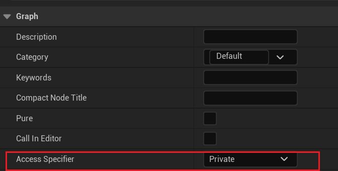

# BlueprintPrivate

- **功能描述：** 指定该函数或属性只能在本类中被调用或读写，类似C++中的private的作用域限制。不可在别的蓝图类里访问。
- **使用位置：** UFUNCTION, UPROPERTY
- **元数据类型：** bool
- **关联项：** [BlueprintProtected](../BlueprintProtected/BlueprintProtected.md)
- **常用程度：** ★★

在函数细节面板上可以设置函数的访问权限：

造成的结果就是在函数上增加BlueprintPrivate=“true”

在细节面板上可以设置属性的

结果也是在属性上增加BlueprintPrivate=“true”

## 行为

UE5.8 property/function metadata；BlueprintGraph `BlueprintPrivate`，限制其他 Blueprint 修改/访问。

## UE5.8 审计结论

- 状态：`verified_UE5.8`。
- 结论：已按 UE5.8 源码验证。
- 证据：
  - UE5.8 `ObjectMacros.h` metadata declaration/comment
  - UE5.8 `BlueprintGraph` metadata constants or node usage
- 批次记录：`references/audits/ue5.8-p1-complete-pass.md`。

## 常见误用

参数名、属性名或目标宏写错导致 metadata 被保留但没有对应编辑器/Blueprint 行为。
