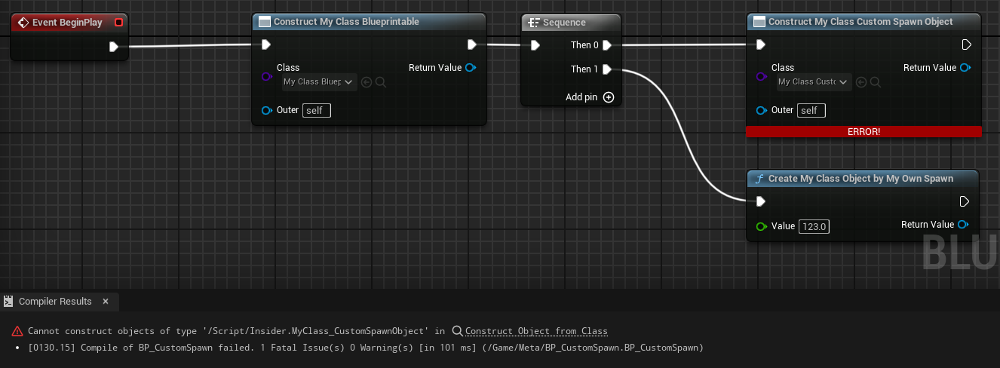

# DontUseGenericSpawnObject

- **功能描述：** 阻止使用蓝图中的Generic Create Object节点来生成本类的对象。
- **使用位置：** UCLASS
- **引擎模块：** Blueprint
- **元数据类型：** bool
- **限制类型：** 既非Actor又非ActorComponent的BluprintType类时
- **常用程度：** ★★

用于阻止该类被通用的ConstructObject蓝图节点所构造出来。在源码里典型里使用例子是UDragDropOperation和UUserWidget，前者由UK2Node_CreateDragDropOperation这个专门的节点建出来（内部调用UWidgetBlueprintLibrary::CreateDragDropOperation），后者由CreateWidget创建。因此这种的典型用法是你自己再创建一个New的函数来自己创建该Object。

## 测试代码：

```cpp
UCLASS(Blueprintable,meta=(DontUseGenericSpawnObject="true"))
class INSIDER_API UMyClass_CustomSpawnObject :public UObject
{
	GENERATED_BODY()
public:
	UPROPERTY(BlueprintReadWrite,EditAnywhere)
	float MyFloat;

	UFUNCTION(BlueprintCallable)
	static UMyClass_CustomSpawnObject* CreateMyClassObjectByMyOwnSpawn(float value)
	{
		UMyClass_CustomSpawnObject* obj= NewObject<UMyClass_CustomSpawnObject>();
		obj->MyFloat=value;
		return obj;
	}
};
```

## 测试效果：



## 原理：

会提前验证是否包含DontUseGenericSpawnObject元数据，因为是采用GetBoolMetaData，因此必须写上=”true”

```cpp
struct FK2Node_GenericCreateObject_Utils
{
	static bool CanSpawnObjectOfClass(TSubclassOf<UObject> ObjectClass, bool bAllowAbstract)
	{
		// Initially include types that meet the basic requirements.
		// Note: CLASS_Deprecated is an inherited class flag, so any subclass of an explicitly-deprecated class also cannot be spawned.
		bool bCanSpawnObject = (nullptr != *ObjectClass)
			&& (bAllowAbstract || !ObjectClass->HasAnyClassFlags(CLASS_Abstract))
			&& !ObjectClass->HasAnyClassFlags(CLASS_Deprecated | CLASS_NewerVersionExists);

		// UObject is a special case where if we are allowing abstract we are going to allow it through even though it doesn't have BlueprintType on it
		if (bCanSpawnObject && (!bAllowAbstract || (*ObjectClass != UObject::StaticClass())))
		{
			static const FName BlueprintTypeName(TEXT("BlueprintType"));
			static const FName NotBlueprintTypeName(TEXT("NotBlueprintType"));
			static const FName DontUseGenericSpawnObjectName(TEXT("DontUseGenericSpawnObject"));

			auto IsClassAllowedLambda = [](const UClass* InClass)
			{
				return InClass != AActor::StaticClass()
					&& InClass != UActorComponent::StaticClass();
			};

			// Exclude all types in the initial set by default.
			bCanSpawnObject = false;
			const UClass* CurrentClass = ObjectClass;

			// Climb up the class hierarchy and look for "BlueprintType." If "NotBlueprintType" is seen first, or if the class is not allowed, then stop searching.
			while (!bCanSpawnObject && CurrentClass != nullptr && !CurrentClass->GetBoolMetaData(NotBlueprintTypeName) && IsClassAllowedLambda(CurrentClass))
			{
				// Include any type that either includes or inherits 'BlueprintType'
				bCanSpawnObject = CurrentClass->GetBoolMetaData(BlueprintTypeName);

				// Stop searching if we encounter 'BlueprintType' with 'DontUseGenericSpawnObject'
				if (bCanSpawnObject && CurrentClass->GetBoolMetaData(DontUseGenericSpawnObjectName))
				{
					bCanSpawnObject = false;
					break;
				}

				CurrentClass = CurrentClass->GetSuperClass();
			}

			// If we validated the given class, continue walking up the hierarchy to make sure we exclude it if it's an Actor or ActorComponent derivative.
			while (bCanSpawnObject && CurrentClass != nullptr)
			{
				bCanSpawnObject &= IsClassAllowedLambda(CurrentClass);

				CurrentClass = CurrentClass->GetSuperClass();
			}
		}

		return bCanSpawnObject;
	}
};
```

## 行为

UE5.8 class metadata；BlueprintGraph `K2Node_GenericCreateObject` 读取它，阻止 Generic Create Object 节点生成该类对象。

## UE5.8 审计结论

- 状态：`verified_UE5.8`。
- 结论：已按 UE5.8 源码验证。
- 证据：
  - UE5.8 `ObjectMacros.h` metadata declaration/comment
  - UE5.8 `BlueprintGraph` metadata constants or node usage
- 批次记录：`references/audits/ue5.8-p1-complete-pass.md`。

## 常见误用

参数名、属性名或目标宏写错导致 metadata 被保留但没有对应编辑器/Blueprint 行为。
