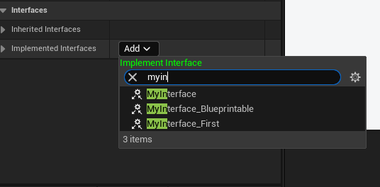

# ProhibitedInterfaces

- **功能描述：** 列出与蓝图类不兼容的接口，阻止实现
- **使用位置：** UCLASS
- **引擎模块：** Blueprint
- **元数据类型：** strings="a，b，c"
- **常用程度：** ★★

## 测试代码：

```cpp
UINTERFACE(Blueprintable,MinimalAPI)
class UMyInterface_First:public UInterface
{
	GENERATED_UINTERFACE_BODY()
};

class INSIDER_API IMyInterface_First
{
	GENERATED_IINTERFACE_BODY()
public:
	UFUNCTION(BlueprintCallable, BlueprintImplementableEvent)
	void FirstFunc() const;
};

UINTERFACE(Blueprintable,MinimalAPI)
class UMyInterface_Second:public UInterface
{
	GENERATED_UINTERFACE_BODY()
};

class INSIDER_API IMyInterface_Second
{
	GENERATED_IINTERFACE_BODY()
public:
	UFUNCTION(BlueprintCallable, BlueprintImplementableEvent)
	void SecondFunc() const;
};

UCLASS(Blueprintable,meta=(ProhibitedInterfaces="UMyInterface_Second"))
class INSIDER_API UMyClass_ProhibitedInterfaces :public UObject
{
	GENERATED_BODY()
public:
};
```

## 测试结果：

发现UMyInterface_Second被阻止实现了，但是UMyInterface_First依然可以被实现



## 原理代码：

可以看到在构造列表的时候，进行了过滤筛选。同时发现了.RightChop(1);的使用，因此填的接口名称，要加上U的前缀。如果UMyInterface_Second

```cpp
TSharedRef<SWidget> FBlueprintEditorUtils::ConstructBlueprintInterfaceClassPicker( const TArray< UBlueprint* >& Blueprints, const FOnClassPicked& OnPicked)
{
	//...

		UClass const* const ParentClass = Blueprint->ParentClass;
		// see if the parent class has any prohibited interfaces
		if ((ParentClass != nullptr) && ParentClass->HasMetaData(FBlueprintMetadata::MD_ProhibitedInterfaces))
		{
			FString const& ProhibitedList = Blueprint->ParentClass->GetMetaData(FBlueprintMetadata::MD_ProhibitedInterfaces);

			TArray<FString> ProhibitedInterfaceNames;
			ProhibitedList.ParseIntoArray(ProhibitedInterfaceNames, TEXT(","), true);

			// loop over all the prohibited interfaces
			for (int32 ExclusionIndex = 0; ExclusionIndex < ProhibitedInterfaceNames.Num(); ++ExclusionIndex)
			{
				ProhibitedInterfaceNames[ExclusionIndex].TrimStartInline();
				FString const& ProhibitedInterfaceName = ProhibitedInterfaceNames[ExclusionIndex].RightChop(1);
				UClass* ProhibitedInterface = UClass::TryFindTypeSlow<UClass>(ProhibitedInterfaceName);
				if(ProhibitedInterface)
				{
					Filter->DisallowedClasses.Add(ProhibitedInterface);
					Filter->DisallowedChildrenOfClasses.Add(ProhibitedInterface);
				}
			}
		}

		// Do not allow adding interfaces that are already added to the Blueprint
		TArray<UClass*> InterfaceClasses;
		FindImplementedInterfaces(Blueprint, true, InterfaceClasses);
		for(UClass* InterfaceClass : InterfaceClasses)
		{
			Filter->DisallowedClasses.Add(InterfaceClass);
		}

		// Include a class viewer filter for imported namespaces if the class picker is being hosted in an editor context
		TSharedPtr<IToolkit> AssetEditor = FToolkitManager::Get().FindEditorForAsset(Blueprint);
		if (AssetEditor.IsValid() && AssetEditor->IsBlueprintEditor())
		{
			TSharedPtr<IBlueprintEditor> BlueprintEditor = StaticCastSharedPtr<IBlueprintEditor>(AssetEditor);
			TSharedPtr<IClassViewerFilter> ImportedClassViewerFilter = BlueprintEditor->GetImportedClassViewerFilter();
			if (ImportedClassViewerFilter.IsValid())
			{
				Options.ClassFilters.AddUnique(ImportedClassViewerFilter.ToSharedRef());
			}
		}
	}

	// never allow parenting to children of itself
	for (UClass*  BPClass : BlueprintClasses)
	{
		Filter->DisallowedChildrenOfClasses.Add(BPClass);
	}

	return FModuleManager::LoadModuleChecked<FClassViewerModule>("ClassViewer").CreateClassViewer(Options, OnPicked);
}
```

## 行为

UE5.8 class/interface metadata；ObjectMacros 标注为指定不兼容接口列表。

## UE5.8 审计结论

- 状态：`verified_UE5.8`。
- 结论：已按 UE5.8 源码验证。
- 证据：
  - UE5.8 `ObjectMacros.h` metadata declaration/comment
  - UE5.8 `BlueprintGraph` metadata constants or node usage
- 批次记录：`references/audits/ue5.8-p1-complete-pass.md`。

## 常见误用

参数名、属性名或目标宏写错导致 metadata 被保留但没有对应编辑器/Blueprint 行为。
