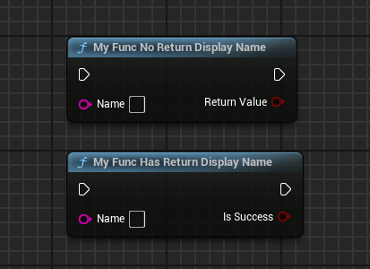

# ReturnDisplayName

- **功能描述：** 改变函数返回值的名字，默认是ReturnValue
- **使用位置：** UFUNCTION
- **引擎模块：** Blueprint
- **元数据类型：** string="abc"
- **常用程度：** ★★★★★

函数的返回值引脚名字默认是ReturnValue，如果想自己提供一个更有意义的名字，则可以用ReturnDisplayName 来自定义一个名字。

## 测试代码：

```cpp
	UFUNCTION(BlueprintCallable, meta = (ReturnDisplayName = "IsSuccess"))
	static bool MyFunc_HasReturnDisplayName(FString Name) { return true; }

	UFUNCTION(BlueprintCallable, meta = ())
	static bool MyFunc_NoReturnDisplayName(FString Name) { return true; }
```

## 蓝图效果：

对比返回值的名字可以验证效果。



## 原理：

原理也很简单，在Pin上判断Meta并设置PinFriendlyName

```cpp
if (Function->GetReturnProperty() == Param && Function->HasMetaData(FBlueprintMetadata::MD_ReturnDisplayName))
{
	Pin->PinFriendlyName = Function->GetMetaDataText(FBlueprintMetadata::MD_ReturnDisplayName);
}
```

## 行为

UE5.8 function metadata；BlueprintGraph 定义为 return pin 显示名。

## UE5.8 审计结论

- 状态：`verified_UE5.8`。
- 结论：已按 UE5.8 源码验证。
- 证据：
  - UE5.8 `ObjectMacros.h` metadata declaration/comment
  - UE5.8 `BlueprintGraph` metadata constants or node usage
- 批次记录：`references/audits/ue5.8-p1-complete-pass.md`。

## 常见误用

参数名、属性名或目标宏写错导致 metadata 被保留但没有对应编辑器/Blueprint 行为。
