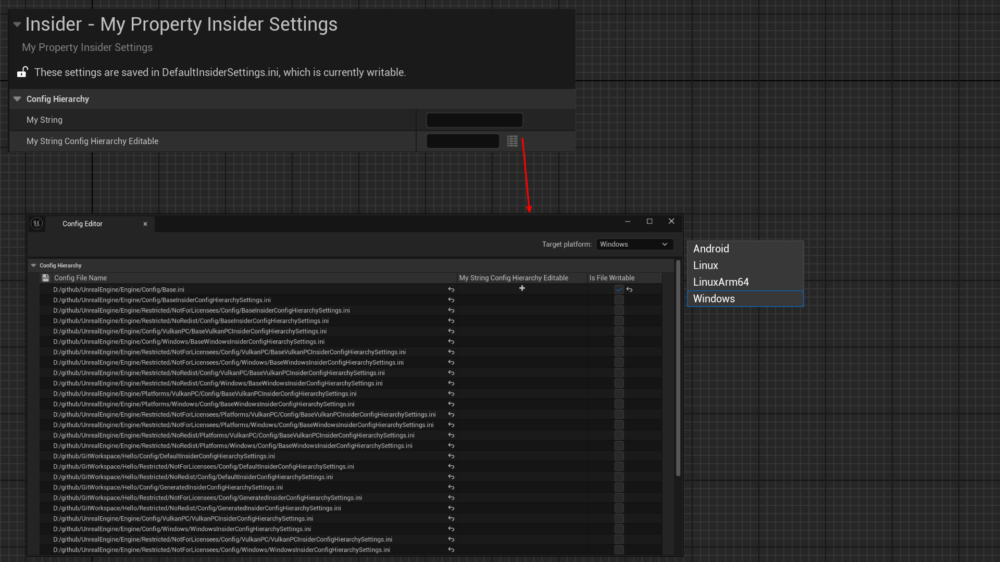

# ConfigHierarchyEditable

- **功能描述：** 使得一个属性可以在Config的各个层级配置。
- **使用位置：** UPROPERTY
- **引擎模块：** Config
- **元数据类型：** bool
- **常用程度：** ★★★

使得一个属性可以在Config的各个层级配置。

- 所谓Config的层级，指的是Base，ProjectDefault，EnginePlatform，ProjectPlatform这些逐级被更高优先级的覆盖。这部分知识大家可以参考网上其他的config详解文章。
- 一般的带有Config的属性，其配置值只存在于UCLASS上的config标识符指定的config文件中。但如果该属性加上ConfigHierarchyEditable这个标记，就允许它在各个层级都可以进行不同的配置。这种属性一般是有根据不同平台而要配置不同的值的需求，比如一些平台相关的性能参数等。

## 测试例子：

```cpp
UCLASS(config = InsiderSettings, defaultconfig)
class UMyProperty_InsiderSettings :public UDeveloperSettings
{
	GENERATED_BODY()
public:
	UPROPERTY(Config, EditAnywhere, BlueprintReadWrite, Category = ConfigHierarchy)
	FString MyString;

	UPROPERTY(Config, EditAnywhere, BlueprintReadWrite, Category = ConfigHierarchy, meta = (ConfigHierarchyEditable))
	FString MyString_ConfigHierarchyEditable;
};
```

## 测试效果：

可以见到MyString_ConfigHierarchyEditable输入框的右边出现了个层级按钮，可打开一个专门的ConfigEditor，方便你分别在不同的平台和不同的层级配置不同的值。



## 源码例子：

```cpp

UCLASS(config = Game, defaultconfig)
class COMMONUI_API UCommonUISettings : public UObject
{
		/** The set of traits defined per-platform (e.g., the default input mode, whether or not you can exit the application, etc...) */
		UPROPERTY(config, EditAnywhere, Category = "Visibility", meta=(Categories="Platform.Trait", ConfigHierarchyEditable))
		TArray<FGameplayTag> PlatformTraits;
}
```

## 原理：

逻辑很简单，就是在细节面板生成ValueWidget的时候，根据ConfigHierarchyEditable配置额外再生成一个层级配置按钮。

```cpp
void FDetailPropertyRow::MakeValueWidget( FDetailWidgetRow& Row, const TSharedPtr<FDetailWidgetRow> InCustomRow, bool bAddWidgetDecoration ) const
{
	// Don't add config hierarchy to container children, can't edit child properties at the hiearchy's per file level
	TSharedPtr<IPropertyHandle> ParentHandle = PropertyHandle->GetParentHandle();
	bool bIsChildProperty = ParentHandle && (ParentHandle->AsArray() || ParentHandle->AsMap() || ParentHandle->AsSet());

	if (!bIsChildProperty && PropertyHandle->HasMetaData(TEXT("ConfigHierarchyEditable")))
	{
		ValueWidget->AddSlot()
		.AutoWidth()
		.VAlign(VAlign_Center)
		.HAlign(HAlign_Left)
		.Padding(4.0f, 0.0f, 4.0f, 0.0f)
		[
			PropertyCustomizationHelpers::MakeEditConfigHierarchyButton(FSimpleDelegate::CreateSP(PropertyEditor.ToSharedRef(), &FPropertyEditor::EditConfigHierarchy))
		];
	}
}
```

## 行为

UE5.8 property metadata；ObjectMacros 标注为 config 属性可沿 config hierarchy 编辑。

## UE5.8 审计结论

- 状态：`verified_UE5.8`。
- 结论：已按 UE5.8 源码验证。
- 证据：
  - UE5.8 `ObjectMacros.h` config property metadata declaration/comment
  - UE5.8 `SettingsEditor`/`DeveloperSettings` metadata usage
- 批次记录：`references/audits/ue5.8-p1-complete-pass.md`。

## 常见误用

参数名、属性名或目标宏写错导致 metadata 被保留但没有对应编辑器/Blueprint 行为。
