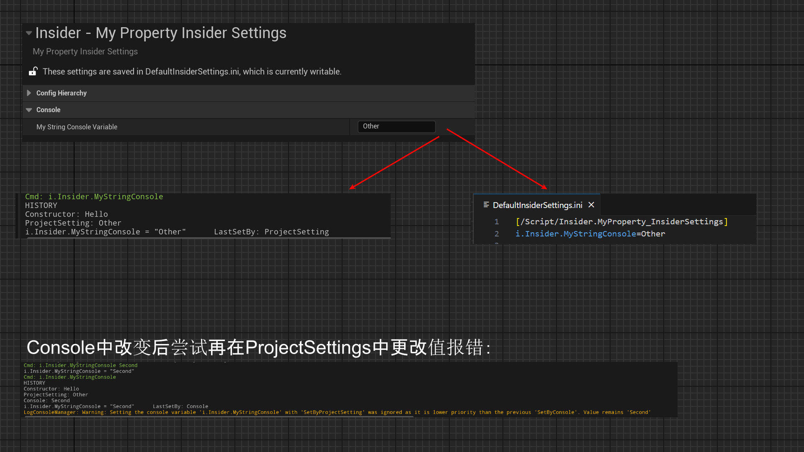

# ConsoleVariable

- **功能描述：** 把一个Conifg属性的值同步到一个同名的控制台变量。
- **使用位置：** UPROPERTY
- **引擎模块：** Config
- **元数据类型：** string="abc"
- **常用程度：** ★★★★★

把一个Conifg属性的值同步到一个同名的控制台变量。

- Config值往往也确实需要在控制台（按~）中更改，这种需求挺常见的，因此就有了这个标记。典型的例子是源码中的URendererSettings有相匹配的一系列“r.”开头的控制变量。
- Config文件中的值也会变成这个ConsoleVariable 的名字（一般形如 r.XXX.XX之类的格式），而不是属性名。
- 但单单加上这个标记是不够的，这个控制台变量是不会被自动创建出来的。因此需要自己再用代码创建，用类似TAutoConsoleVariable这种注册同名的控制台变量。
- 有了控制台变量之后，也需要专门的代码来对二者的值进行同步。见下述测试代码ImportConsoleVariableValues和ExportValuesToConsoleVariables的调用。
- 另外要格外注意，ConsoleVariable 的设置是有优先级的。Console的优先级比ProjectSettings高，因此如果在Console中改变后再尝试在ProjectSettings中更改值，就会报错。

## 测试代码：

```cpp
UCLASS(config = InsiderSettings, defaultconfig)
class UMyProperty_InsiderSettings :public UDeveloperSettings
{
	GENERATED_BODY()
public:
	UPROPERTY(Config, EditAnywhere, BlueprintReadWrite, Category = Console, meta = (ConsoleVariable = "i.Insider.MyStringConsole"))
	FString MyString_ConsoleVariable;
public:
	virtual void PostInitProperties() override;
#if WITH_EDITOR
	virtual void PostEditChangeProperty(FPropertyChangedEvent& PropertyChangedEvent) override;
#endif
};

//.cpp
static TAutoConsoleVariable<FString> CVarInsiderMyStringConsole(
	TEXT("i.Insider.MyStringConsole"),
	TEXT("Hello"),
	TEXT("Insider test config to set MyString."));

void UMyProperty_InsiderSettings::PostInitProperties()
{
	Super::PostInitProperties();

#if WITH_EDITOR
	if (IsTemplate())
	{
		ImportConsoleVariableValues();
	}
#endif // #if WITH_EDITOR
}

#if WITH_EDITOR
void UMyProperty_InsiderSettings::PostEditChangeProperty(FPropertyChangedEvent& PropertyChangedEvent)
{
	Super::PostEditChangeProperty(PropertyChangedEvent);

	if (PropertyChangedEvent.Property)
	{
		ExportValuesToConsoleVariables(PropertyChangedEvent.Property);
	}
}
#endif // #if WITH_EDITOR
```

## 测试结果：

可见一开始的时候控制台和配置文件的值都是和ProjectSettings中的值同步。

如果在Console中改变后再尝试在ProjectSettings中更改值，就会报错。



## 原理：

具体的值同步逻辑可见以下两个函数就知道了，无非是根据名字去寻找相应的ConsoleVariable 然后get/set值。

```cpp
void UDeveloperSettings::ImportConsoleVariableValues()
{}

void UDeveloperSettings::ExportValuesToConsoleVariables(FProperty* PropertyThatChanged)
{}
```

## 行为

UE5.8 property metadata；settings/detail customization 读取它，将 config 属性关联到 console variable。

## UE5.8 审计结论

- 状态：`verified_UE5.8`。
- 结论：已按 UE5.8 源码验证。
- 证据：
  - UE5.8 `ObjectMacros.h` config property metadata declaration/comment
  - UE5.8 `SettingsEditor`/`DeveloperSettings` metadata usage
- 批次记录：`references/audits/ue5.8-p1-complete-pass.md`。

## 常见误用

参数名、属性名或目标宏写错导致 metadata 被保留但没有对应编辑器/Blueprint 行为。
