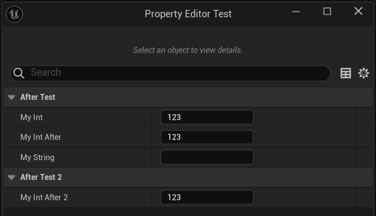

# DisplayAfter

- **功能描述：** 使本属性在指定的属性之后显示。
- **使用位置：** UPROPERTY
- **引擎模块：** DetailsPanel
- **元数据类型：** string="abc"
- **常用程度：** ★★★

使本属性在指定的属性之后显示。

- 默认情况下，属性在细节面板中的顺序是依照头文件中的定义顺序。但如果我们想自己调节这个顺序，就可以用该标记。
- 限制条件是这两个属性必须得是在同一个Category下。这也很好理解，Category组织的优先级肯定更大。

## 测试代码：

```cpp
UCLASS(BlueprintType)
class INSIDER_API UMyProperty_Priority :public UObject
{
	GENERATED_BODY()
public:
	UPROPERTY(EditAnywhere, BlueprintReadWrite, Category = AfterTest)
	int32 MyInt = 123;

	UPROPERTY(EditAnywhere, BlueprintReadWrite, Category = AfterTest)
	FString MyString;

	UPROPERTY(EditAnywhere, BlueprintReadWrite, Category = AfterTest, meta = (DisplayAfter = "MyInt"))
	int32 MyInt_After = 123;
public:
	UPROPERTY(EditAnywhere, BlueprintReadWrite, Category = AfterTest2, meta = (DisplayAfter = "MyInt"))
	int32 MyInt_After2 = 123;

};
```

## 测试效果：

可见MyInt_After直接在Int后显示。

而MyInt_After2 因为在不同的Category下，因此就保留原样。



## 原理：

检查该属性如果有DisplayAfter，就把它插入在指定的属性之后。

```cpp
	void PropertyEditorHelpers::OrderPropertiesFromMetadata(TArray<FProperty*>& Properties)
	{
		const FString& DisplayAfterPropertyName = Prop->GetMetaData(NAME_DisplayAfter);
		if (DisplayAfterPropertyName.IsEmpty())
		{
			InsertProperty(OrderedProperties);
		}
		else
		{
			TArray<TPair<FProperty*, int32>>& DisplayAfterProperties = DisplayAfterPropertyMap.FindOrAdd(FName(*DisplayAfterPropertyName));
			InsertProperty(DisplayAfterProperties);
		}
	}
```

## 行为

UE5.8 property metadata；ObjectMacros 标注为 Details 中显示在指定 sibling property 后。

## UE5.8 审计结论

- 状态：`verified_UE5.8`。
- 结论：已按 UE5.8 源码验证。
- 证据：
  - UE5.8 `ObjectMacros.h` property/class metadata declaration/comment
  - UE5.8 `PropertyEditor` Details metadata usage
- 批次记录：`references/audits/ue5.8-p1-complete-pass.md`。

## 常见误用

参数名、属性名或目标宏写错导致 metadata 被保留但没有对应编辑器/Blueprint 行为。
