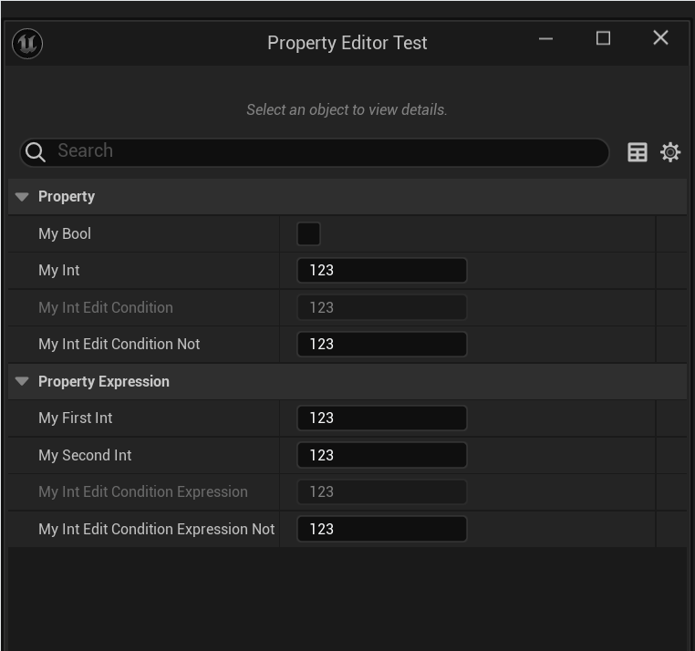

# EditConditionHides

- **功能描述：** 在已经有EditCondition的情况下，指定该属性在EditCondition不满足的情况下隐藏起来。
- **使用位置：** UPROPERTY
- **元数据类型：** bool
- **关联项：** [EditCondition](../EditCondition/EditCondition.md)
- **常用程度：** ★★★★★

在已经有EditCondition的情况下，指定该属性在EditCondition不满足的情况下隐藏起来。

## 测试代码：

```cpp
UCLASS(BlueprintType)
class INSIDER_API UMyProperty_EditCondition_Test :public UObject
{
	GENERATED_BODY()
public:
	UPROPERTY(EditAnywhere, BlueprintReadWrite, Category = Property)
	bool MyBool;

	UPROPERTY(EditAnywhere, BlueprintReadWrite, Category = Property, meta = (EditConditionHides, EditCondition = "MyBool"))
	int32 MyInt_EditCondition_Hides = 123;

public:
	UPROPERTY(EditAnywhere, BlueprintReadWrite, Category = PropertyExpression)
	int32 MyFirstInt = 123;

	UPROPERTY(EditAnywhere, BlueprintReadWrite, Category = PropertyExpression)
	int32 MySecondInt = 123;

	UPROPERTY(EditAnywhere, BlueprintReadWrite, Category = PropertyExpression, meta = (EditConditionHides, EditCondition = "(MyFirstInt+MySecondInt)==500"))
	int32 MyInt_EditConditionExpression_Hides = 123;
};
```

## 测试效果：

下面的图中可以明显见到两个属性随着条件的满足显示了出来。



## 原理：

其实就是加了个是否显示的判断。

```cpp
bool FPropertyNode::IsOnlyVisibleWhenEditConditionMet() const
{
	static const FName Name_EditConditionHides("EditConditionHides");
	if (Property.IsValid() && Property->HasMetaData(Name_EditConditionHides))
	{
		return HasEditCondition();
	}

	return false;
}
```

## 行为

UE5.8 PropertyEditor 在属性带 `EditConditionHides` 时，只有存在有效 `EditCondition` 才把条件失败的 row 隐藏，而不是仅禁用。

## UE5.8 审计结论

- 状态：`verified_UE5.8`。
- 结论：已按 UE5.8 源码验证。
- 证据：
  - UE5.8 `PropertyNode.cpp` `IsOnlyVisibleWhenEditConditionMet`
- 批次记录：`references/audits/ue5.8-p0-complete-pass.md`。

## 常见误用

不写 `EditCondition` 只写 `EditConditionHides`；或期待它隐藏整个自定义分类。
