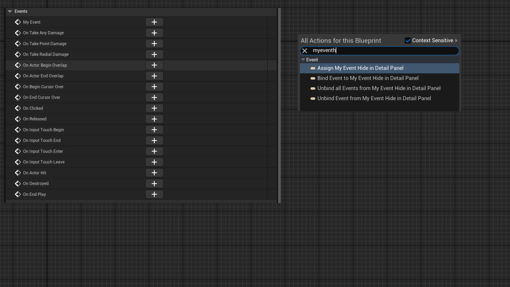

# HideInDetailPanel

- **功能描述：** 在Actor的事件面板里隐藏该动态多播委托属性。
- **使用位置：** UPROPERTY
- **引擎模块：** DetailsPanel
- **元数据类型：** bool
- **限制类型：** Actor里的动态多播委托
- **常用程度：** ★★

在Actor的事件面板里隐藏该动态多播委托属性。

## 测试代码：

```cpp
UCLASS(BlueprintType,Blueprintable)
class INSIDER_API AMyProperty_HideInDetailPanel :public AActor
{
	GENERATED_BODY()
public:
	DECLARE_DYNAMIC_MULTICAST_DELEGATE(FOnMyHideTestEvent);

	UPROPERTY(BlueprintAssignable, Category = "Event")
	FOnMyHideTestEvent MyEvent;

	UPROPERTY(BlueprintAssignable, Category = "Event", meta = (HideInDetailPanel))
	FOnMyHideTestEvent MyEvent_HideInDetailPanel;
};

```

## 测试效果：

测试步骤是在蓝图里创建AMyProperty_HideInDetailPanel 的子类，然后观察Event的显示情况。

可见MyEvent会显示在Class Defautls里的Events，而MyEvent_HideInDetailPanel则没有显示。

不过MyEvent_HideInDetailPanel依然是可以在蓝图里进行绑定，只不过默认没显示在UI上而已。



## 原理：

先判断没有这个标记，然后创建相应的UI控件。

```cpp
void FActorDetails::AddEventsCategory(IDetailLayoutBuilder& DetailBuilder)
{
		IDetailCategoryBuilder& EventsCategory = DetailBuilder.EditCategory("Events", FText::GetEmpty(), ECategoryPriority::Uncommon);
		static const FName HideInDetailPanelName("HideInDetailPanel");

		// Find all the Multicast delegate properties and give a binding button for them
		for (TFieldIterator<FMulticastDelegateProperty> PropertyIt(Actor->GetClass(), EFieldIteratorFlags::IncludeSuper); PropertyIt; ++PropertyIt)
		{
			FMulticastDelegateProperty* Property = *PropertyIt;

			// Only show BP assiangable, non-hidden delegates
			if (!Property->HasAnyPropertyFlags(CPF_Parm) && Property->HasAllPropertyFlags(CPF_BlueprintAssignable) && !Property->HasMetaData(HideInDetailPanelName))
			{}
		}
}

void FBlueprintDetails::AddEventsCategory(IDetailLayoutBuilder& DetailBuilder, FName PropertyName, UClass* PropertyClass)
{
	static const FName HideInDetailPanelName("HideInDetailPanel");
// Check for multicast delegates that we can safely assign
if ( !Property->HasAnyPropertyFlags(CPF_Parm) && Property->HasAllPropertyFlags(CPF_BlueprintAssignable) &&
				!Property->HasMetaData(HideInDetailPanelName) )
}
```

## 行为

UE5.8 property metadata；ObjectMacros 标注为隐藏 Details row，当前主要事件路径使用。

## UE5.8 审计结论

- 状态：`verified_UE5.8`。
- 结论：已按 UE5.8 源码验证。
- 证据：
  - UE5.8 `ObjectMacros.h` property/class metadata declaration/comment
  - UE5.8 `PropertyEditor` Details metadata usage
- 批次记录：`references/audits/ue5.8-p1-complete-pass.md`。

## 常见误用

参数名、属性名或目标宏写错导致 metadata 被保留但没有对应编辑器/Blueprint 行为。
