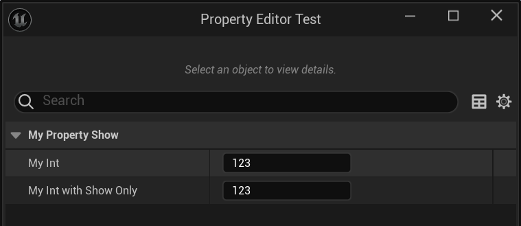

# bShowOnlyWhenTrue

- **功能描述：** 旧 Details 条件显示 metadata。UE5.8 新代码通常应优先使用 `EditCondition`/`EditConditionHides`。
- **使用位置：** UPROPERTY
- **引擎模块：** DetailsPanel
- **元数据类型：** string="abc"
- **常用程度：** ★

根据编辑器config配置文件里字段值来决定当前属性是否显示。

- 这个编辑器config配置文件，指的是GEditorPerProjectIni，因此一般是Config\DefaultEditorPerProjectUserSettings.ini
- 其中Section的名字是“UnrealEd.PropertyFilters”
- 然后Key的值就可以定了。

在源码里没有找到使用的例子，但这依然是可以工作的。

## 测试代码：

```cpp
D:\github\GitWorkspace\Hello\Config\DefaultEditorPerProjectUserSettings.ini
[UnrealEd.PropertyFilters]
ShowMyInt=true
ShowMyString=false

UCLASS(BlueprintType)
class INSIDER_API UMyProperty_Show :public UObject
{
	GENERATED_BODY()
public:
	UPROPERTY(EditAnywhere, BlueprintReadWrite)
	int32 MyInt = 123;

	UPROPERTY(EditAnywhere, BlueprintReadWrite, meta = (bShowOnlyWhenTrue = "ShowMyInt"))
	int32 MyInt_WithShowOnly = 123;

	UPROPERTY(EditAnywhere, BlueprintReadWrite, meta = (bShowOnlyWhenTrue = "ShowMyString"))
	FString MyString_WithShowOnly;
};
```

## 测试结果：

可见MyString_WithShowOnly就没有显示出来，因为我们在DefaultEditorPerProjectUserSettings中配置了ShowMyString=false。



## 原理：

就是取得config中的值用来决定属性框是否显示。

```cpp
void FObjectPropertyNode::GetCategoryProperties(const TSet<UClass*>& ClassesToConsider, const FProperty* CurrentProperty, bool bShouldShowDisableEditOnInstance, bool bShouldShowHiddenProperties,
	const TSet<FName>& CategoriesFromBlueprints, TSet<FName>& CategoriesFromProperties, TArray<FName>& SortedCategories)
{
	bool bMetaDataAllowVisible = true;
	const FString& ShowOnlyWhenTrueString = CurrentProperty->GetMetaData(Name_bShowOnlyWhenTrue);
	if (ShowOnlyWhenTrueString.Len())
	{
		//ensure that the metadata visibility string is actually set to true in order to show this property
		GConfig->GetBool(TEXT("UnrealEd.PropertyFilters"), *ShowOnlyWhenTrueString, bMetaDataAllowVisible, GEditorPerProjectIni);
	}

	if (bMetaDataAllowVisible)
	{
		if (PropertyEditorHelpers::ShouldBeVisible(*this, CurrentProperty) && !HiddenCategories.Contains(CategoryName))
		{
			if (!CategoriesFromBlueprints.Contains(CategoryName) && !CategoriesFromProperties.Contains(CategoryName))
			{
				SortedCategories.AddUnique(CategoryName);
			}
			CategoriesFromProperties.Add(CategoryName);
		}
	}

}

void FCategoryPropertyNode::InitChildNodes()
{
		bool bMetaDataAllowVisible = true;
		if (!bShowHiddenProperties)
		{
						static const FName Name_bShowOnlyWhenTrue("bShowOnlyWhenTrue");
						const FString& MetaDataVisibilityCheckString = It->GetMetaData(Name_bShowOnlyWhenTrue);
						if (MetaDataVisibilityCheckString.Len())
						{
							//ensure that the metadata visibility string is actually set to true in order to show this property
							// @todo Remove this
							GConfig->GetBool(TEXT("UnrealEd.PropertyFilters"), *MetaDataVisibilityCheckString, bMetaDataAllowVisible, GEditorPerProjectIni);
						}
		}

}
```

## 行为

UE5.8 legacy details metadata；旧 details 路径按 bool 条件显示，现代通常优先 `EditCondition`/`EditConditionHides`。

## UE5.8 审计结论

- 状态：`verified_UE5.8`。
- 结论：已按 UE5.8 源码验证。
- 证据：
  - UE5.8 `ObjectMacros.h` property/class metadata declaration/comment
  - UE5.8 `PropertyEditor` Details metadata usage
- 批次记录：`references/audits/ue5.8-p1-complete-pass.md`。

## 常见误用

继续把 legacy metadata 当成新代码首选；现代 Details 条件显示优先使用 `EditCondition`/`EditConditionHides`。
