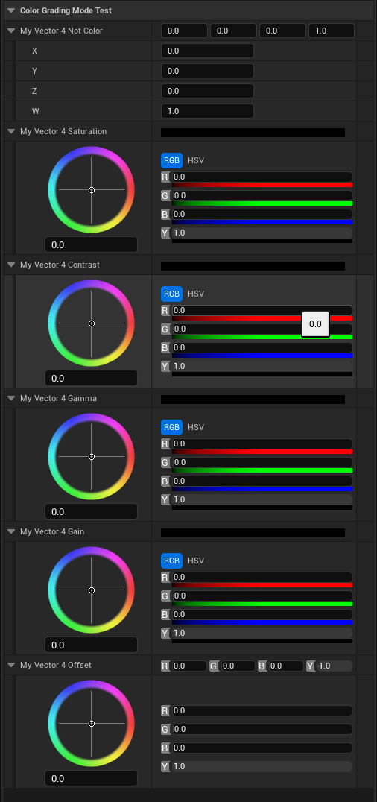

# ColorGradingMode

- **功能描述：** 使得一个FVector4属性成为颜色显示
- **使用位置：** UPROPERTY
- **引擎模块：** Numeric Property
- **元数据类型：** string="abc"
- **限制类型：** FVector4
- **常用程度：** ★★

使得一个FVector4属性成为颜色显示。因为FVector4和RGBA正好对应。

必须配合UIMin，UIMax才能使用，否则会崩溃，因为FColorGradingVectorCustomization里直接对UIMinValue直接取值。

## 测试代码：

```cpp
	UPROPERTY(EditAnywhere, BlueprintReadWrite, Category = ColorGradingModeTest, meta = ())
	FVector4 MyVector4_NotColor;

	UPROPERTY(EditAnywhere, BlueprintReadWrite, Category = ColorGradingModeTest, meta = (UIMin = "0", UIMax = "1",ColorGradingMode = "saturation"))
	FVector4 MyVector4_Saturation;
	UPROPERTY(EditAnywhere, BlueprintReadWrite, Category = ColorGradingModeTest, meta = (UIMin = "0", UIMax = "1",ColorGradingMode = "contrast"))
	FVector4 MyVector4_Contrast;
	UPROPERTY(EditAnywhere, BlueprintReadWrite, Category = ColorGradingModeTest, meta = (UIMin = "0", UIMax = "1",ColorGradingMode = "gamma"))
	FVector4 MyVector4_Gamma;
	UPROPERTY(EditAnywhere, BlueprintReadWrite, Category = ColorGradingModeTest, meta = (UIMin = "0", UIMax = "1",ColorGradingMode = "gain"))
	FVector4 MyVector4_Gain;
	UPROPERTY(EditAnywhere, BlueprintReadWrite, Category = ColorGradingModeTest, meta = (UIMin = "0", UIMax = "1",ColorGradingMode = "offset"))
	FVector4 MyVector4_Offset;
```

## 测试效果：

可以发现没有ColorGradingMode 的依然是普通的FVector4，否则就会用颜色转盘来显示编辑。



## 原理：

如果是FVector4属性，再判断如果有ColorGradingMode，则创建FColorGradingVectorCustomization来把FVector定制化会颜色显示。再根据字符串判断EColorGradingModes，最后创建相应的具体UI控件。

```cpp
void FVector4StructCustomization::CustomizeChildren(TSharedRef<IPropertyHandle> StructPropertyHandle, IDetailChildrenBuilder& StructBuilder, IPropertyTypeCustomizationUtils& StructCustomizationUtils)
{
	FProperty* Property = StructPropertyHandle->GetProperty();
	if (Property)
	{
		const FString& ColorGradingModeString = Property->GetMetaData(TEXT("ColorGradingMode"));
		if (!ColorGradingModeString.IsEmpty())
		{
			//Create our color grading customization shared pointer
			TSharedPtr<FColorGradingVectorCustomization> ColorGradingCustomization = GetOrCreateColorGradingVectorCustomization(StructPropertyHandle);

			//Customize the childrens
			ColorGradingVectorCustomization->CustomizeChildren(StructBuilder, StructCustomizationUtils);

			// We handle the customize Children so just return here
			return;
		}
	}

	//Use the base class customize children
	FMathStructCustomization::CustomizeChildren(StructPropertyHandle, StructBuilder, StructCustomizationUtils);
}

EColorGradingModes FColorGradingVectorCustomizationBase::GetColorGradingMode() const
{
	EColorGradingModes ColorGradingMode = EColorGradingModes::Invalid;

	if (ColorGradingPropertyHandle.IsValid())
	{
		//Query all meta data we need
		FProperty* Property = ColorGradingPropertyHandle.Pin()->GetProperty();
		const FString& ColorGradingModeString = Property->GetMetaData(TEXT("ColorGradingMode"));

		if (ColorGradingModeString.Len() > 0)
		{
			if (ColorGradingModeString.Compare(TEXT("saturation")) == 0)
			{
				ColorGradingMode = EColorGradingModes::Saturation;
			}
			else if (ColorGradingModeString.Compare(TEXT("contrast")) == 0)
			{
				ColorGradingMode = EColorGradingModes::Contrast;
			}
			else if (ColorGradingModeString.Compare(TEXT("gamma")) == 0)
			{
				ColorGradingMode = EColorGradingModes::Gamma;
			}
			else if (ColorGradingModeString.Compare(TEXT("gain")) == 0)
			{
				ColorGradingMode = EColorGradingModes::Gain;
			}
			else if (ColorGradingModeString.Compare(TEXT("offset")) == 0)
			{
				ColorGradingMode = EColorGradingModes::Offset;
			}
		}
	}

	return ColorGradingMode;
}
```

## 行为

UE5.8 numeric/color metadata；颜色分级相关 property customization 使用。

## UE5.8 审计结论

- 状态：`verified_UE5.8`。
- 结论：已按 UE5.8 源码验证。
- 证据：
  - UE5.8 `ObjectMacros.h` numeric property metadata declaration/comment
  - UE5.8 Details numeric/color customization metadata usage
- 批次记录：`references/audits/ue5.8-p1-complete-pass.md`。

## 常见误用

参数名、属性名或目标宏写错导致 metadata 被保留但没有对应编辑器/Blueprint 行为。
