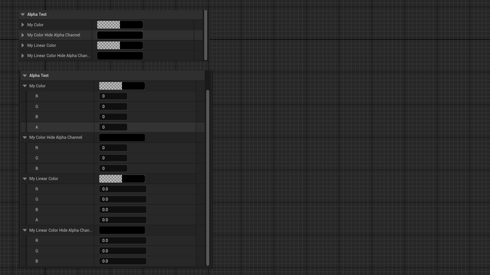

# HideAlphaChannel

- **功能描述：** 使FColor或FLinearColor属性在编辑的时候隐藏Alpha通道。
- **使用位置：** UPROPERTY
- **引擎模块：** Numeric Property
- **元数据类型：** bool
- **限制类型：** FColor , FLinearColor
- **常用程度：** ★★★

使FColor或FLinearColor属性在编辑的时候隐藏Alpha通道。

## 测试代码：

```cpp
public:
	UPROPERTY(EditAnywhere, Category = AlphaTest)
	FColor MyColor;

	UPROPERTY(EditAnywhere, Category = AlphaTest, meta = (HideAlphaChannel))
	FColor MyColor_HideAlphaChannel;

	UPROPERTY(EditAnywhere, Category = AlphaTest)
	FLinearColor MyLinearColor;

	UPROPERTY(EditAnywhere, Category = AlphaTest, meta = (HideAlphaChannel))
	FLinearColor MyLinearColor_HideAlphaChannel;
```

## 测试结果：

可见带有HideAlphaChannel的属性就没有了Alpha通道。



## 原理：

```cpp
void FColorStructCustomization::CustomizeHeader(TSharedRef<class IPropertyHandle> InStructPropertyHandle, class FDetailWidgetRow& InHeaderRow, IPropertyTypeCustomizationUtils& StructCustomizationUtils)
{
	bIgnoreAlpha = TypeSupportsAlpha() == false || StructPropertyHandle->GetProperty()->HasMetaData(TEXT("HideAlphaChannel"));
}

.AlphaDisplayMode(bIgnoreAlpha ? EColorBlockAlphaDisplayMode::Ignore : EColorBlockAlphaDisplayMode::Separate)

```

## 行为

UE5.8 color metadata；ObjectMacros 标注为隐藏 FColor/FLinearColor alpha 通道。

## UE5.8 审计结论

- 状态：`verified_UE5.8`。
- 结论：已按 UE5.8 源码验证。
- 证据：
  - UE5.8 `ObjectMacros.h` numeric property metadata declaration/comment
  - UE5.8 Details numeric/color customization metadata usage
- 批次记录：`references/audits/ue5.8-p1-complete-pass.md`。

## 常见误用

参数名、属性名或目标宏写错导致 metadata 被保留但没有对应编辑器/Blueprint 行为。
