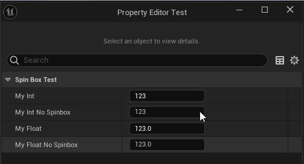

# NoSpinbox

- **功能描述：** 使数值属性禁止默认的拖放和滚轮的UI编辑功能，数值属性包括int系列以及float系列。
- **使用位置：** UPROPERTY
- **引擎模块：** Numeric Property
- **元数据类型：** bool
- **限制类型：** Numeric Type, int / float
- **常用程度：** ★★

使数值属性禁止默认的拖放和滚轮的UI编辑功能，数值属性包括int系列以及float系列。

## 测试代码：

```cpp
public:
	UPROPERTY(EditAnywhere, BlueprintReadWrite,Category=SpinBoxTest)
	int32 MyInt = 123;

	UPROPERTY(EditAnywhere, BlueprintReadWrite,Category=SpinBoxTest, meta = (NoSpinbox = true))
	int32 MyInt_NoSpinbox = 123;

	UPROPERTY(EditAnywhere, BlueprintReadWrite,Category=SpinBoxTest)
	float MyFloat = 123;

	UPROPERTY(EditAnywhere, BlueprintReadWrite,Category=SpinBoxTest, meta = (NoSpinbox = true))
	float MyFloat_NoSpinbox = 123;
```

## 测试效果：

发现带有NoSpinbox 的属性不能用鼠标左右拖动改变数值，也不能用鼠标滚轮改变数值。



## 原理：

可以看到针对数值的UI，bAllowSpin的功能直接决定了Widget的AllowWheel和AllowSpin功能。

```cpp
virtual TSharedRef<SWidget>	GetDefaultValueWidget() override
{
	const typename TNumericPropertyParams<NumericType>::FMetaDataGetter MetaDataGetter = TNumericPropertyParams<NumericType>::FMetaDataGetter::CreateLambda([&](const FName& Key)
		{
			return (PinProperty) ? PinProperty->GetMetaData(Key) : FString();
		});

	TNumericPropertyParams<NumericType> NumericPropertyParams(PinProperty, PinProperty ? MetaDataGetter : nullptr);

	const bool bAllowSpin = !(PinProperty && PinProperty->GetBoolMetaData("NoSpinbox"));

	// Save last committed value to compare when value changes
	LastSliderCommittedValue = GetNumericValue().GetValue();

	return SNew(SBox)
		.MinDesiredWidth(MinDesiredBoxWidth)
		.MaxDesiredWidth(400)
		[
			SNew(SNumericEntryBox<NumericType>)
			.EditableTextBoxStyle(FAppStyle::Get(), "Graph.EditableTextBox")
			.BorderForegroundColor(FSlateColor::UseForeground())
			.Visibility(this, &SGraphPinNumSlider::GetDefaultValueVisibility)
			.IsEnabled(this, &SGraphPinNumSlider::GetDefaultValueIsEditable)
			.Value(this, &SGraphPinNumSlider::GetNumericValue)
			.MinValue(NumericPropertyParams.MinValue)
			.MaxValue(NumericPropertyParams.MaxValue)
			.MinSliderValue(NumericPropertyParams.MinSliderValue)
			.MaxSliderValue(NumericPropertyParams.MaxSliderValue)
			.SliderExponent(NumericPropertyParams.SliderExponent)
			.Delta(NumericPropertyParams.Delta)
			.LinearDeltaSensitivity(NumericPropertyParams.GetLinearDeltaSensitivityAttribute())
			.AllowWheel(bAllowSpin)
			.WheelStep(NumericPropertyParams.WheelStep)
			.AllowSpin(bAllowSpin)
			.OnValueCommitted(this, &SGraphPinNumSlider::OnValueCommitted)
			.OnValueChanged(this, &SGraphPinNumSlider::OnValueChanged)
			.OnBeginSliderMovement(this, &SGraphPinNumSlider::OnBeginSliderMovement)
			.OnEndSliderMovement(this, &SGraphPinNumSlider::OnEndSliderMovement)
		];
}
```

## 行为

UE5.8 numeric metadata；ObjectMacros 标注为隐藏 integer/float spinbox 控件。

## UE5.8 审计结论

- 状态：`verified_UE5.8`。
- 结论：已按 UE5.8 源码验证。
- 证据：
  - UE5.8 `ObjectMacros.h` numeric property metadata declaration/comment
  - UE5.8 Details numeric/color customization metadata usage
- 批次记录：`references/audits/ue5.8-p1-complete-pass.md`。

## 常见误用

参数名、属性名或目标宏写错导致 metadata 被保留但没有对应编辑器/Blueprint 行为。
