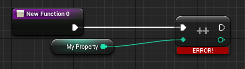
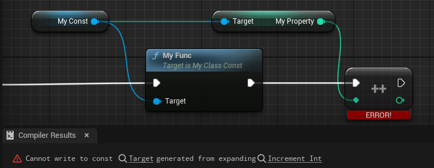

# Const

- **功能描述：** 表示本类的内部属性不可在蓝图中被修改，只读不可写。
- **引擎模块：** Blueprint
- **元数据类型：** bool
- **作用机制：** 在ClassFlags中添加CLASS_Abstract
- **常用程度：** ★★★

表示本类的内部属性不可在蓝图中被修改，只读不可写。

继承的蓝图类也是如此。其实就是自动的给本类和子类上添加const的标志。注意只是在蓝图里检查，C++依然可以随意改变，遵循C++的规则。所以这个const是只给蓝图用的，在蓝图里检查。函数依然可以随便调用，只是没有属性的Set方法了，也不能改变了。

## 示例代码：

```cpp
/*
	ClassFlags:	CLASS_MatchedSerializers | CLASS_Native | CLASS_Const | CLASS_RequiredAPI | CLASS_TokenStreamAssembled | CLASS_Intrinsic | CLASS_Constructed
*/
UCLASS(Blueprintable, Const)
class INSIDER_API UMyClass_Const :public UObject
{
	GENERATED_BODY()
public:
	UPROPERTY(EditAnywhere, BlueprintReadWrite)
	int32 MyProperty = 123;
	UFUNCTION(BlueprintCallable)
	void MyFunc() { ++MyProperty; }
};
```

## 示例效果：

在蓝图子类中尝试修改属性会报错。



跟蓝图Class Settings里打开这个开关设定的一样




## 原理：

Const类生成的实例属性对带有const的标记，从而阻止修改自身的属性。

```cpp
void FKCHandler_VariableSet::InnerAssignment(FKismetFunctionContext& Context, UEdGraphNode* Node, UEdGraphPin* VariablePin, UEdGraphPin* ValuePin)
{
	if (!(*VariableTerm)->IsTermWritable())
	{
		CompilerContext.MessageLog.Error(*LOCTEXT("WriteConst_Error", "Cannot write to const @@").ToString(), VariablePin);
	}
}

bool FBPTerminal::IsTermWritable() const
{
	return !bIsLiteral && !bIsConst;
}
```

## 行为

UE5.8 UHT 写入 `CLASS_Const`，影响对象/接口属性和函数 const 相关反射路径。

## UE5.8 审计结论

- 状态：`verified_UE5.8`。
- 结论：已按 UE5.8 源码验证。
- 证据：
  - UE5.8 `UhtClassSpecifiers.cs` class specifier branch
  - UE5.8 `UhtClass.cs` class flag/metadata resolution and validation
- 批次记录：`references/audits/ue5.8-p1-complete-pass.md`。

## 常见误用

把 class specifier 的 metadata/flag 结果和 property/function specifier 混淆；或忽略继承/撤销类 specifier 的相互作用。
