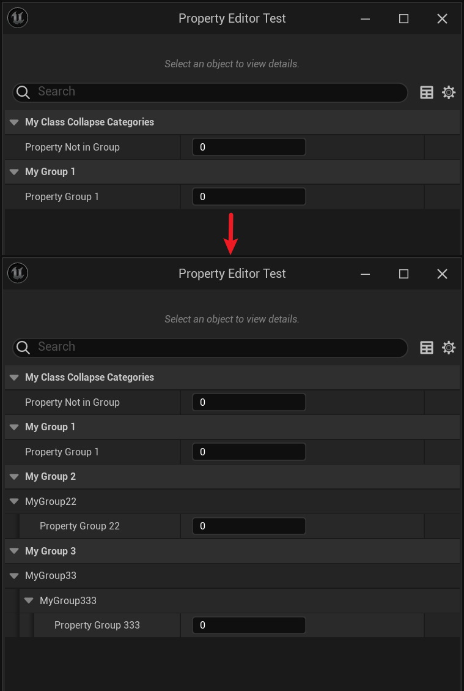

# CollapseCategories

- **功能描述：**  在类的属性面板里隐藏所有带Category的属性，但是只对带有多个嵌套Category的属性才起作用。
- **引擎模块：** Category
- **元数据类型：** bool
- **作用机制：** 在ClassFlags中添加CLASS_CollapseCategories
- **关联项：** [DontCollapseCategories](../DontCollapseCategories.md)
- **常用程度：★★**

在类的属性面板里隐藏所有带Category的属性，但是只对带有多个嵌套Category的属性才起作用。

## 示例代码：

```cpp
/*
ClassFlags: CLASS_MatchedSerializers | CLASS_Native | CLASS_CollapseCategories | CLASS_RequiredAPI | CLASS_TokenStreamAssembled | CLASS_Intrinsic | CLASS_Constructed
*/
UCLASS(Blueprintable, CollapseCategories)
class INSIDER_API UMyClass_CollapseCategories :public UObject
{
	GENERATED_BODY()
public:
	UPROPERTY(EditAnywhere, BlueprintReadWrite)
		int Property_NotInGroup;
	UPROPERTY(EditAnywhere, BlueprintReadWrite, Category = "MyGroup1")
		int Property_Group1;
	UPROPERTY(EditAnywhere, BlueprintReadWrite, Category = "MyGroup2|MyGroup22")
		int Property_Group22;

	UPROPERTY(EditAnywhere, BlueprintReadWrite, Category = "MyGroup3|MyGroup33|MyGroup333")
		int Property_Group333;
};

/*
ClassFlags: CLASS_MatchedSerializers | CLASS_Native | CLASS_RequiredAPI | CLASS_TokenStreamAssembled | CLASS_Intrinsic | CLASS_Constructed
*/
UCLASS(Blueprintable, dontCollapseCategories)
class INSIDER_API UMyClass_DontCollapseCategories :public UMyClass_CollapseCategories
{
	GENERATED_BODY()
public:
};
```

## 示例效果：

第一个是UMyClass_CollapseCategories 的效果，第二个是UMyClass_DontCollapseCategories 的效果，可见一些属性被隐藏了起来。



## 原理：

```cpp
if (Specifier == TEXT("collapseCategories"))
{
	// Class' properties should not be shown categorized in the editor.
	ClassFlags |= CLASS_CollapseCategories;
}
else if (Specifier == TEXT("dontCollapseCategories"))
{
	// Class' properties should be shown categorized in the editor.
	ClassFlags &= ~CLASS_CollapseCategories;
}
```

## 行为

UE5.8 UHT 写入 `CLASS_CollapseCategories`，让 Details 中属性默认不按分类展开显示。

## UE5.8 审计结论

- 状态：`verified_UE5.8`。
- 结论：已按 UE5.8 源码验证。
- 证据：
  - UE5.8 `UhtClassSpecifiers.cs` class specifier branch
  - UE5.8 `UhtClass.cs` class flag/metadata resolution and validation
- 批次记录：`references/audits/ue5.8-p1-complete-pass.md`。

## 常见误用

把 class specifier 的 metadata/flag 结果和 property/function specifier 混淆；或忽略继承/撤销类 specifier 的相互作用。
