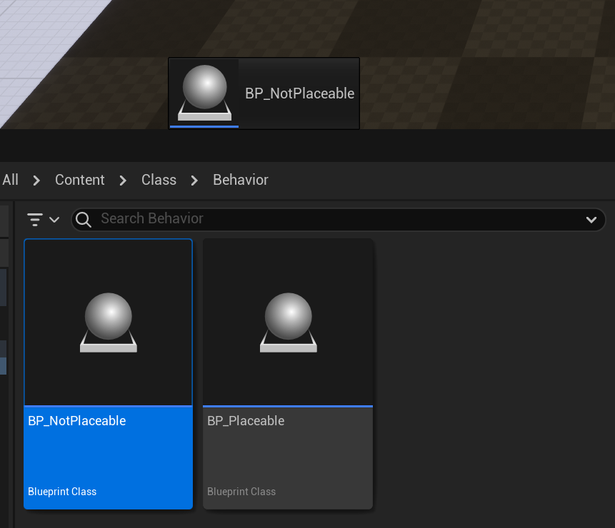

# NotPlaceable

- **功能描述：** 标明该Actor不可被放置在关卡里
- **引擎模块：** Behavior
- **元数据类型：** bool
- **作用机制：** 在ClassFlags中添加CLASS_NotPlaceable
- **关联项：** Placeable (Placeable.md)
- **常用程度：★★★**

标明该Actor不可被放置在关卡里，没法拖放到场景里。使继承自基类的Placeable说明符无效。会在ClassFlagss里标记上CLASS_NotPlaceable，这个标记是可以继承的，意味着其所有的子类默认都不可放置。例如AWorldSettings其实就是一个notplaceable的Actor。

但是注意该类依然可以通过SpawnActor动态生成到关卡中。

NotPlaceable的类是不出现在PlaceMode的类选择里去的。

## 示例代码：

```cpp
UCLASS(Blueprintable,BlueprintType, NotPlaceable)
class INSIDER_API AMyActor_NotPlaceable :public AActor
{
	GENERATED_BODY()
};
```

## 示例效果：

拖动到场景里会发现不能创建Actor。



## 原理：

如果直接是C++类AMyActor_NotPlaceable ，是可以直接从ContentBrowser拖到场景里去的。看源码可知，只有BP继承下来的子类才有受到这个限制。

```cpp
TArray<AActor*> FLevelEditorViewportClient::TryPlacingActorFromObject( ULevel* InLevel, UObject* ObjToUse, bool bSelectActors, EObjectFlags ObjectFlags, UActorFactory* FactoryToUse, const FName Name, const FViewportCursorLocation* Cursor )
{

	bool bPlace = true;
	if (ObjectClass->IsChildOf(UBlueprint::StaticClass()))
	{
		UBlueprint* BlueprintObj = StaticCast<UBlueprint*>(ObjToUse);
		bPlace = BlueprintObj->GeneratedClass != NULL;
		if(bPlace)
		{
			check(BlueprintObj->ParentClass == BlueprintObj->GeneratedClass->GetSuperClass());
			if (BlueprintObj->GeneratedClass->HasAnyClassFlags(CLASS_NotPlaceable | CLASS_Abstract))
			{
				bPlace = false;
			}
		}
	}

	if (bPlace)
	{
		PlacedActor = FActorFactoryAssetProxy::AddActorForAsset( ObjToUse, bSelectActors, ObjectFlags, FactoryToUse, Name );
		if ( PlacedActor != NULL )
		{
			PlacedActors.Add(PlacedActor);
			PlacedActor->PostEditMove(true);
		}
	}
}
```

## 行为

UE5.8 UHT 写入 `CLASS_NotPlaceable`，类不能在关卡/编辑器放置路径中作为 placeable 类使用。

## UE5.8 审计结论

- 状态：`verified_UE5.8`。
- 结论：已按 UE5.8 源码验证。
- 证据：
  - UE5.8 `UhtClassSpecifiers.cs` class specifier branch
  - UE5.8 `UhtClass.cs` class flag/metadata resolution and validation
- 批次记录：`references/audits/ue5.8-p1-complete-pass.md`。

## 常见误用

把 class specifier 的 metadata/flag 结果和 property/function specifier 混淆；或忽略继承/撤销类 specifier 的相互作用。
