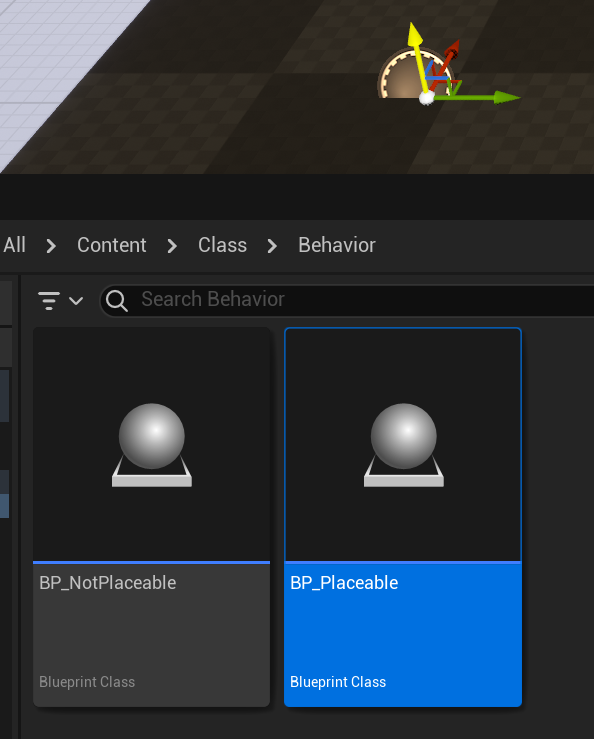

# Placeable

- **功能描述：**  标明该Actor可以放置在关卡里。
- **引擎模块：** Scene
- **元数据类型：** bool
- **作用机制：** 在ClassFlags中移除CLASS_NotPlaceable
- **关联项：** [NotPlaceable](../NotPlaceable/NotPlaceable.md)
- **常用程度：★★★**

标明该Actor可以放置在关卡里。

默认情况下是placeable的，因此源码里目前没有用到Placeable的地方。

子类可使用NotPlaceable说明符覆盖此标志，正如AInfo之类的上面自己设置NotPlaceable。

指示可在编辑器中创建此类，而且可将此类放置到关卡、UI场景或蓝图（取决于类类型）中。此标志会传播到所有子类；

placeable没法清除父类的notplaceable标记。

## 示例代码：

```cpp
UCLASS(Blueprintable, BlueprintType,placeable)
class INSIDER_API AMyActor_Placeable :public AMyActor_NotPlaceable
{
	GENERATED_BODY()
};
error : The 'placeable' specifier cannot override a 'nonplaceable' base class. Classes are assumed to be placeable by default. Consider whether using the 'abstract' specifier on the base class would work.
```

## 示例效果：



## 行为

UE5.8 UHT 移除 `CLASS_NotPlaceable`，让类恢复可放置语义。

## UE5.8 审计结论

- 状态：`verified_UE5.8`。
- 结论：已按 UE5.8 源码验证。
- 证据：
  - UE5.8 `UhtClassSpecifiers.cs` class specifier branch
  - UE5.8 `UhtClass.cs` class flag/metadata resolution and validation
- 批次记录：`references/audits/ue5.8-p1-complete-pass.md`。

## 常见误用

把 class specifier 的 metadata/flag 结果和 property/function specifier 混淆；或忽略继承/撤销类 specifier 的相互作用。
