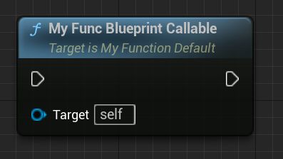

# BlueprintCallable

- **功能描述：** 暴露到蓝图中可被调用

- **元数据类型：** bool
- **引擎模块：** Blueprint
- **作用机制：** 在FunctionFlags增加[FUNC_BlueprintCallable](../../../../Flags/EFunctionFlags/FUNC_BlueprintCallable.md)
- **常用程度：** ★★★★★

## 行为

`BlueprintCallable` 把 C++ 函数暴露为 Blueprint 可调用节点。它只表示可调用，不表示函数是 pure、线程安全、只在服务端执行或自动拥有某种权限。

## UE5.8 审计结论

在 UE5.8 UHT 源码 `UhtFunctionSpecifiers.cs` 中，`BlueprintCallableSpecifier` 会设置 `EFunctionFlags.BlueprintCallable`。函数在 Blueprint 菜单中的分类和展示还会受到 `Category`、函数所在类、访问上下文、metadata 以及 Blueprint 类型限制影响。

## 常见误用

- `BlueprintCallable` 不等于 `BlueprintPure`；需要无执行引脚的纯函数时使用 `BlueprintPure`。
- 需要网络权限或表现层限制时另加 `BlueprintAuthorityOnly`、`BlueprintCosmetic` 或运行时校验。
- 建议为常用节点提供清晰 `Category`，否则路由和查找体验会变差。

## 测试代码：

```cpp
UFUNCTION(BlueprintCallable)
void MyFunc_BlueprintCallable() {}
```

## 效果展示：


