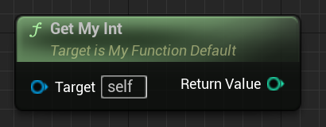

# BlueprintPure

- **功能描述：** 指定作为一个纯函数，一般用于Get函数用来返回值。
- **元数据类型：** bool
- **引擎模块：** Blueprint
- **作用机制：** 在FunctionFlags增加[FUNC_BlueprintCallable](../../../../Flags/EFunctionFlags/FUNC_BlueprintCallable.md)、[FUNC_BlueprintPure](../../../../Flags/EFunctionFlags/FUNC_BlueprintPure.md)
- **常用程度：** ★★★★★

指定作为一个纯函数，一般用于Get函数用来返回值。

- 纯函数是指没有执行引脚的函数，不是指const函数。
- 纯函数可以有多个返回值，用引用参数加到函数里就行。
- 不能用于void函数，否则会报错“error : BlueprintPure specifier is not allowed for functions with no return value and no output parameters.”

## 行为

`BlueprintPure` 把函数暴露为 Blueprint pure 节点：没有执行引脚，调用结果由数据依赖驱动。它不等于 C++ `const`，也不保证函数真的没有副作用；这是 Blueprint 节点形态和 UHT flag 语义。

## UE5.8 审计结论

在 UE5.8 UHT 源码 `UhtFunctionSpecifiers.cs` 中，`BlueprintPureSpecifier` 会先设置 `EFunctionFlags.BlueprintCallable`；未写值或值为 true 时再设置 `EFunctionFlags.BlueprintPure`，值为 false 时设置 `ForceBlueprintImpure`。`UhtFunction.cs` 还会把满足条件的 `const BlueprintCallable` 输出函数自动标为 pure，并拒绝无返回值且无 output 参数的 pure 函数。Hello 样例 `Function/MyFunction_Default.h` 中 `GetMyInt() const` 的 flags 包含 `FUNC_BlueprintCallable | FUNC_BlueprintPure | FUNC_Const`。

## 常见误用

- 不要把 `BlueprintPure` 当成“无副作用”的强保证；UE5.8 源码里也注明 C++ `const` 与真实 purity 并不等价。
- pure 函数必须有返回值或 output 参数；纯 `void` 函数会被 UHT 拒绝。
- 如果想让 `const BlueprintCallable` 函数保持 impure 节点形态，可使用 `BlueprintPure=false`，不要同时写 true/false 两种 pure 声明。

## 测试代码：

```cpp
UFUNCTION(BlueprintPure)
	int32 GetMyInt()const { return MyInt; }
private:
	int32 MyInt;
```

## 效果展示：


