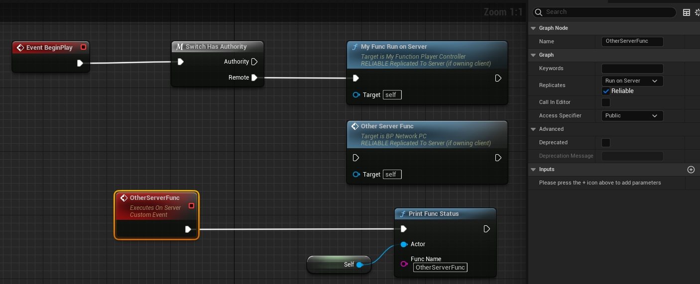

# Server

- **功能描述：** 在Client-owned的Actor上（PlayerController或Pawn）执行一个RPC函数，只运行在服务器上。对应的实现函数会添加_Implementation后缀

- **元数据类型：** bool
- **引擎模块：** Network
- **作用机制：** 在FunctionFlags中加入[FUNC_Net](../../../../Flags/EFunctionFlags/FUNC_Net.md)、[FUNC_NetServer](../../../../Flags/EFunctionFlags/FUNC_NetServer.md)
- **常用程度：★★★★★**

在Client-owned的Actor上（PlayerController或Pawn）执行一个RPC函数，只运行在服务器上。对应的实现函数会添加_Implementation后缀。

和RunOnServer的效果一样。

所谓Client-owned，参考文档：[https://docs.unrealengine.com/4.27/zh-CN/InteractiveExperiences/Networking/Actors/RPCs/](https://docs.unrealengine.com/4.27/zh-CN/InteractiveExperiences/Networking/Actors/RPCs/)



## 测试代码：

```cpp
UCLASS(Blueprintable, BlueprintType)
class INSIDER_API AMyFunction_PlayerController :public APlayerController
{
	GENERATED_BODY()
public:
UFUNCTION(BlueprintCallable, Server, Reliable)
	void MyFunc_RunOnServer();
};

void AMyFunction_PlayerController::MyFunc_RunOnServer_Implementation()
{
	UInsiderLibrary::PrintFuncStatus(this, TEXT("MyFunc_RunOnServer_Implementation"));
}
```

测试蓝图：PIE模式，一个ListenServer+2Client


## 测试输出结果：

```cpp
LogInsider: Display: 5118b400    MyFunc_RunOnServer_Implementation   BP_NetworkPC_C_1    NM_ListenServer Local:ROLE_Authority    Remote:ROLE_AutonomousProxy
LogInsider: Display: 44ec3c00    MyFunc_RunOnServer_Implementation   BP_NetworkPC_C_2    NM_ListenServer Local:ROLE_Authority    Remote:ROLE_AutonomousProxy

LogInsider: Display: 49999000    OtherServerFunc BP_NetworkPC_C_1    NM_ListenServer Local:ROLE_Authority    Remote:ROLE_AutonomousProxy
LogInsider: Display: 4bcbd800    OtherServerFunc BP_NetworkPC_C_2    NM_ListenServer Local:ROLE_Authority    Remote:ROLE_AutonomousProxy
```

可见，测试代码中取第2个PC，发出一个Run on Server的RPC调用，最终在Server上成功触发。C++定义的函数和蓝图中添加的自定义RunOnServer事件效果是等价的。

而如果这个函数在Server owned Actor上执行，则只会在运行在服务器上，不会传递到客户端。

## 行为

在 UE5.8 UHT 中写入 `FUNC_Net | FUNC_NetServer`，并允许可选 C++ implementation name。UHT 拒绝 Blueprint event/Exec 与 replicated function 的非法组合。

## UE5.8 审计结论

- 状态：`verified_UE5.8`。
- 结论：已按 UE5.8 源码验证。
- 证据：
  - UE5.8 `UhtFunctionSpecifiers.cs` 对应 specifier 分支
  - UE5.8 `UhtFunction.cs` replicated/event 校验
  - 本地样例辅助对照：`D:/github/GitWorkspace/Hello/Source/Insider/Function/MyFunction_PlayerController.h`。
- 批次记录：`references/audits/ue5.8-p0-complete-pass.md`。

## 常见误用

从不具备 ownership/authority 路径的对象上调用；或漏写 `Reliable`/`Unreliable`。
