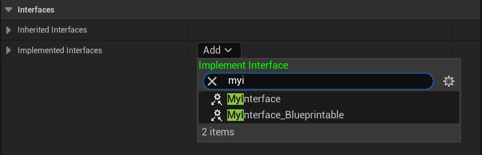

# Blueprintable

- **功能描述：**  可以在蓝图中实现
- **元数据类型：** bool
- **引擎模块：** Blueprint
- **作用机制：** 在Meta中加入[IsBlueprintBase](../../../../Meta/Blueprint/IsBlueprintBase.md), [BlueprintType](../../../../Meta/Blueprint/BlueprintType.md)
- **关联项：** [NotBlueprintable](../NotBlueprintable/NotBlueprintable.md)
- **常用程度：★★★★★**

是否可以在蓝图中实现。

## 示例代码：

```cpp
UINTERFACE(Blueprintable,MinimalAPI)
class UMyInterface_Blueprintable:public UInterface
{
	GENERATED_UINTERFACE_BODY()
};

class INSIDER_API IMyInterface_Blueprintable
{
	GENERATED_IINTERFACE_BODY()
public:
	UFUNCTION(BlueprintCallable, BlueprintImplementableEvent)
	void Func_ImplementableEvent() const;

	UFUNCTION(BlueprintCallable,BlueprintNativeEvent)
	void Func_NativeEvent() const;
};

UINTERFACE(NotBlueprintable,MinimalAPI)
class UMyInterface_NotBlueprintable:public UInterface
{
	GENERATED_UINTERFACE_BODY()
};

class INSIDER_API IMyInterface_NotBlueprintable
{
	GENERATED_IINTERFACE_BODY()
public:
//也不得定义蓝图函数，因为已经不能在蓝图中实现了
//UFUNCTION(BlueprintCallable, BlueprintImplementableEvent)
	//void Func_ImplementableEvent() const;

//	UFUNCTION(BlueprintCallable,BlueprintNativeEvent)
//	void Func_NativeEvent() const;
};
```

## 示例效果：

在蓝图中测试，发现UMyInterface_NotBlueprintable并不能找到。



## 行为

UE5.8 UHT 的默认 `Blueprintable` specifier 写入 `IsBlueprintBase=true` 和 `BlueprintType=true` metadata。用于 UINTERFACE 时表示接口可被 Blueprint 实现。

## UE5.8 审计结论

- 状态：`verified_UE5.8`。
- 结论：已按 UE5.8 源码验证。
- 证据：
  - UE5.8 `UhtDefaultSpecifiers.cs` `BlueprintableSpecifier` writes `IsBlueprintBase` and `BlueprintType` metadata
  - 本地样例辅助对照：`D:/github/GitWorkspace/Hello/Source/Insider/Interface/MyInterface_Test.h`。
- 批次记录：`references/audits/ue5.8-p1-macro-param-struct-enum-pass.md`。

## 常见误用

以为只写在 `IInterface` C++ 类上会生效；应写在 `UINTERFACE(...)` 宏所在的 U 类上。
