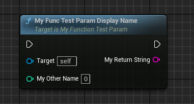

# DisplayName

- **功能描述：** 更改函数参数在蓝图节点上的显示名字

- **元数据类型：** string="abc"
- **引擎模块：** Blueprint, Parameter
- **作用机制：** 在Meta中加入[DisplayName](../../../../Meta/Blueprint/DisplayName.md)
- **常用程度：** ★★★★★

注意：UPARAM也可以用在返回值上，默认值是ReturnValue。

## 测试代码：

```cpp
//(DisplayName = My Other Name)
	UFUNCTION(BlueprintCallable)
	UPARAM(DisplayName = "My Return String") FString MyFuncTestParam_DisplayName(UPARAM(DisplayName = "My Other Name") int value);
```

## 蓝图节点：

