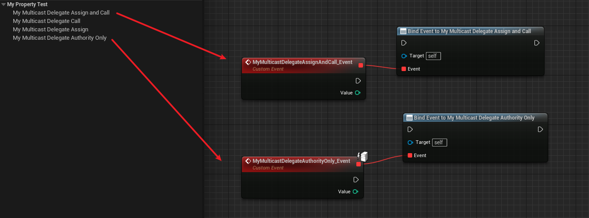

# BlueprintAuthorityOnly

- **功能描述：** 只能绑定为BlueprintAuthorityOnly的事件，让该多播委托只接受在服务端运行的事件

- **元数据类型：** bool
- **引擎模块：** Blueprint, Network
- **限制类型：** Multicast Delegates
- **作用机制：** 在PropertyFlags中加入[CPF_BlueprintAuthorityOnly](../../../../Flags/EPropertyFlags/CPF_BlueprintAuthorityOnly.md)
- **常用程度：** ★★★

## 测试代码：

```cpp
UPROPERTY(EditAnywhere, BlueprintReadWrite, BlueprintAssignable, BlueprintCallable)
		FMyDynamicMulticastDelegate_One MyMulticastDelegateAssignAndCall;

UPROPERTY(EditAnywhere, BlueprintReadWrite, BlueprintAssignable, BlueprintCallable, BlueprintAuthorityOnly)
		FMyDynamicMulticastDelegate_One MyMulticastDelegateAuthorityOnly;
```

## 蓝图中表现：



## 行为

在 UE5.8 UHT 中写入 `CPF_BlueprintAuthorityOnly`，用于 Blueprint 暴露属性的 authority-only 语义，常见于 delegate 属性。

## UE5.8 审计结论

- 状态：`verified_UE5.8`。
- 结论：已按 UE5.8 源码验证。
- 证据：
  - UE5.8 `UhtPropertyMemberSpecifiers.cs` 对应 specifier 分支
- 批次记录：`references/audits/ue5.8-p0-complete-pass.md`。

## 常见误用

把它当成 property replication 或 RPC；或忽略运行时 authority 设计。
