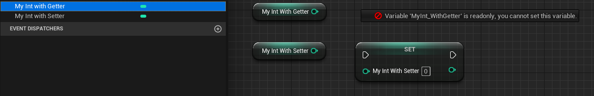

# BlueprintGetter

- **功能描述：** 为属性定义一个自定义的Get函数来读取。

- **元数据类型：** string="abc"
- **引擎模块：** Blueprint
- **作用机制：** 在PropertyFlags中加入CPF_BlueprintReadOnly、CPF_BlueprintVisible，在Meta中加入[BlueprintGetter](../../../../Meta/Blueprint/BlueprintGetter.md)
- **常用程度：** ★★★

为属性定义一个自定义的Get函数来读取。
如果没有设置BlueprintSetter或BlueprintReadWrite，则会默认设置BlueprintReadOnly，这个属性变成只读的。

## 示例代码：

```cpp
public:
	//(BlueprintGetter = , Category = Blueprint, ModuleRelativePath = Property/MyProperty_Test.h)
	UFUNCTION(BlueprintGetter, Category = Blueprint)	//or BlueprintPure
		int32 MyInt_Getter()const { return MyInt_WithGetter * 2; }

	//(BlueprintSetter = , Category = Blueprint, ModuleRelativePath = Property/MyProperty_Test.h)
	UFUNCTION(BlueprintSetter, Category = Blueprint)	//or BlueprintCallable
		void MyInt_Setter(int NewValue) { MyInt_WithSetter = NewValue / 4; }
private:
	//(BlueprintGetter = MyInt_Getter, Category = Blueprint, ModuleRelativePath = Property/MyProperty_Test.h)
	//PropertyFlags:	CPF_BlueprintVisible | CPF_BlueprintReadOnly | CPF_ZeroConstructor | CPF_IsPlainOldData | CPF_NoDestructor | CPF_HasGetValueTypeHash | CPF_NativeAccessSpecifierPrivate
	UPROPERTY(BlueprintGetter = MyInt_Getter, Category = Blueprint)
		int32 MyInt_WithGetter = 123;

	//(BlueprintSetter = MyInt_Setter, Category = Blueprint, ModuleRelativePath = Property/MyProperty_Test.h)
	//PropertyFlags:	CPF_BlueprintVisible | CPF_ZeroConstructor | CPF_IsPlainOldData | CPF_NoDestructor | CPF_HasGetValueTypeHash | CPF_NativeAccessSpecifierPrivate
	UPROPERTY(BlueprintSetter = MyInt_Setter, Category = Blueprint)
		int32 MyInt_WithSetter = 123;
```

## 示例效果：

可见MyInt_WithGetter是只读的。

而MyInt_WithSetter 是可读写的。



## 行为

在 UE5.8 UHT 中写入 `BlueprintGetter` metadata，并把属性标为 `BlueprintVisible`。UHT 拒绝 struct member 使用该 specifier。

## UE5.8 审计结论

- 状态：`verified_UE5.8`。
- 结论：已按 UE5.8 源码验证。
- 证据：
  - UE5.8 `UhtPropertyMemberSpecifiers.cs` 对应 specifier 分支
  - 本地样例辅助对照：`D:/github/GitWorkspace/Hello/Source/Insider/Property/Blueprint/MyProperty_Get.h`。
- 批次记录：`references/audits/ue5.8-p0-complete-pass.md`。

## 常见误用

getter 名称和函数不匹配；或在 USTRUCT 成员上使用。
