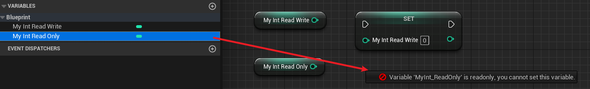

# BlueprintReadWrite

- **功能描述：** 可从蓝图读取或写入此属性。

- **元数据类型：** bool
- **引擎模块：** Blueprint
- **作用机制：** 在PropertyFlags中加入[CPF_BlueprintVisible](../../../../Flags/EPropertyFlags/CPF_BlueprintVisible.md)
- **常用程度：** ★★★★★

可从蓝图读取或写入此属性。

此说明符与 BlueprintReadOnly 说明符不兼容。

## 行为

`BlueprintReadWrite` 让属性对 Blueprint 可读并可写。它只控制 Blueprint 访问权限，不控制 Details Panel 是否可编辑。

如果属性还需要在 Details Panel 中编辑，通常要另外组合 `EditAnywhere`、`EditDefaultsOnly` 或 `EditInstanceOnly`；如果只想在 Blueprint 中读取，不应使用 `BlueprintReadWrite`，应使用 `BlueprintReadOnly`。

## UE5.8 审计结论

状态：`verified_UE5.8`

在 `D:/github/GitWorkspace/Hello/Source/Insider/Property/MyProperty_Test.h` 中，`MyInt_ReadWrite` 的样例注释记录了以下核心 flags：

```text
CPF_BlueprintVisible
```

对照 `BlueprintReadOnly` 样例，`BlueprintReadWrite` 不会加入 `CPF_BlueprintReadOnly`。

`bat/build-hello.bat` 已在 UE5.8 下成功编译 `HelloEditor Win64 Development`，说明该样例可通过 UE5.8 UHT/编译流程。

UE5.8 源码 `C:/Program Files/Epic Games/UE_5.8/Engine/Source/Programs/Shared/EpicGames.UHT/Specifiers/UhtPropertyMemberSpecifiers.cs` 中，UHT 解析逻辑会为 `BlueprintReadWrite` 设置 `BlueprintVisible`，并拒绝与 `BlueprintReadOnly` 同时使用。private 成员默认不能使用 `BlueprintReadWrite`，除非通过 `meta=(AllowPrivateAccess=true)` 放开。

## 示例代码：

```cpp
public:
	//PropertyFlags:	CPF_BlueprintVisible | CPF_ZeroConstructor | CPF_IsPlainOldData | CPF_NoDestructor | CPF_HasGetValueTypeHash | CPF_NativeAccessSpecifierPublic
	UPROPERTY(BlueprintReadWrite, Category = Blueprint)
		int32 MyInt_ReadWrite = 123;
	//PropertyFlags:	CPF_BlueprintVisible | CPF_BlueprintReadOnly | CPF_ZeroConstructor | CPF_IsPlainOldData | CPF_NoDestructor | CPF_HasGetValueTypeHash | CPF_NativeAccessSpecifierPublic
	UPROPERTY(BlueprintReadOnly, Category = Blueprint)
		int32 MyInt_ReadOnly = 123;
```

## 常见误用

- 不要和 `BlueprintReadOnly` 同时使用。
- 不要以为 `BlueprintReadWrite` 会让属性出现在 Details Panel；Details Panel 编辑能力由 `Edit*` 或 `Visible*` 控制。
- private 成员默认不能直接 `BlueprintReadWrite`；如果确实需要暴露，使用 `meta=(AllowPrivateAccess=true)`，但这应是有意的 API 设计。
- 对只读状态、派生状态或不希望 Blueprint 改写的属性，应使用 `BlueprintReadOnly`。

## 示例效果：

蓝图中可读写：



## 原理：

如果有CPF_Edit | CPF_BlueprintVisible | CPF_BlueprintAssignable之一，则可以Get属性。

```cpp
EPropertyAccessResultFlags PropertyAccessUtil::CanGetPropertyValue(const FProperty* InProp)
{
	if (!InProp->HasAnyPropertyFlags(CPF_Edit | CPF_BlueprintVisible | CPF_BlueprintAssignable))
	{
		return EPropertyAccessResultFlags::PermissionDenied | EPropertyAccessResultFlags::AccessProtected;
	}

	return EPropertyAccessResultFlags::Success;
}

```
