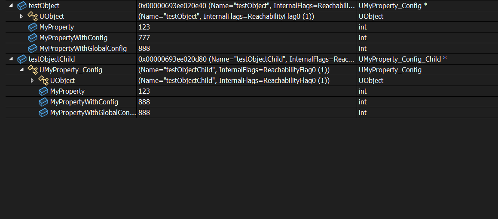

# GlobalConfig

- **功能描述：** 和Config一样指定该属性可作为配置读取和写入ini中，但只会读取写入到配置文件里基类的值，而不会使用配置文件里子类里的值。
- **元数据类型：** bool
- **引擎模块：** Config
- **作用机制：** 在PropertyFlags中加入[CPF_GlobalConfig](../../../../Flags/EPropertyFlags/CPF_GlobalConfig.md)
- **常用程度：** ★★★

和Config一样指定该属性可作为配置读取和写入ini中，但只会读取写入到配置文件里基类的值，而不会使用配置文件里子类里的值。

但是不同点在于，该属性在LoadConfig的时候，只会读取基类的ini，而不会去读取子类的ini。因为只有基类里的Ini设置在生效，相当于全局只有一个配置在生效，因此名字叫做GlobalConfig。

## 行为

`GlobalConfig` 会同时加入 `CPF_GlobalConfig` 和 `CPF_Config`。它仍然是 config 属性，但加载和保存时以属性 owner class 为基准，避免派生类各自覆盖该属性的配置值。

适合“继承体系里所有子类共享同一个配置值”的属性。普通 `Config` 更适合允许派生类或不同 class section 有独立配置的场景。

## UE5.8 审计结论

状态：`verified_UE5.8`

UE5.8 UHT 源码 `C:/Program Files/Epic Games/UE_5.8/Engine/Source/Programs/Shared/EpicGames.UHT/Specifiers/UhtPropertyMemberSpecifiers.cs` 中，`GlobalConfig` 会设置 `EPropertyFlags.GlobalConfig | EPropertyFlags.Config`。

UE5.8 CoreUObject 源码 `Runtime/CoreUObject/Private/UObject/Obj.cpp` 中：

- `LoadConfig` 遇到 `CPF_GlobalConfig` 且 owner class 不同于当前 config class 时，会改用 property owner class 的 section/config branch。
- `SaveConfig` 遇到 `CPF_GlobalConfig` 时使用 property owner class 作为 base class；未显式传入 filename 时，保存目标也会使用 owner class 的 config name。

在 `D:/github/GitWorkspace/Hello/Source/Insider/Property/Config/MyProperty_Config.h` 中，`MyPropertyWithGlobalConfig` 使用 `UPROPERTY(EditAnywhere, BlueprintReadWrite, GlobalConfig)`；对应 cpp 保存父类与子类对象后，样例记录了该值写入父类 section 而不是子类 section。`bat/build-hello.bat` 已在 UE5.8 下成功编译 `HelloEditor Win64 Development`。

## 常见误用

- `GlobalConfig` 不只是 `Config` 的别名；它会改变派生类读取/保存配置值的归属。
- 不要用于希望每个派生类有独立配置值的属性；这种情况应使用普通 `Config`。
- `GlobalConfig` 仍需要类具备合适的 `UCLASS(Config=...)` 配置上下文。
- `GlobalConfig` 不提供 Details Panel 或 Blueprint 访问能力；这些需要额外 specifier。

## 示例代码：

```cpp
UCLASS(Config = MyOtherGame)
class INSIDER_API UMyProperty_Config :public UObject
{
	GENERATED_BODY()
public:
	UPROPERTY(EditAnywhere, BlueprintReadWrite)
	int32 MyProperty = 123;
	UPROPERTY(EditAnywhere, BlueprintReadWrite, Config)
	int32 MyPropertyWithConfig = 123;
	UPROPERTY(EditAnywhere, BlueprintReadWrite, GlobalConfig)
	int32 MyPropertyWithGlobalConfig = 123;
};

UCLASS(Config = MyOtherGame)
class INSIDER_API UMyProperty_Config_Child :public UMyProperty_Config
{
	GENERATED_BODY()
public:
};

void UMyProperty_Config_Test::TestConfigSave()
{
	FString fileName = FPaths::ProjectConfigDir() / TEXT("MyOtherGame.ini");
	fileName = FConfigCacheIni::NormalizeConfigIniPath(fileName);

	{
		UMyProperty_Config* testObject = NewObject<UMyProperty_Config>(GetTransientPackage(), TEXT("testObject"));

		testObject->MyProperty = 777;
		testObject->MyPropertyWithConfig = 777;
		testObject->MyPropertyWithGlobalConfig = 777;

		testObject->SaveConfig(CPF_Config, *fileName);
	}

	{
		UMyProperty_Config_Child* testObject = NewObject<UMyProperty_Config_Child>(GetTransientPackage(), TEXT("testObjectChild"));

		testObject->MyProperty = 888;
		testObject->MyPropertyWithConfig = 888;
		testObject->MyPropertyWithGlobalConfig = 888;

		testObject->SaveConfig(CPF_Config, *fileName);
	}
}

void UMyProperty_Config_Test::TestConfigLoad()
{
	FString fileName = FPaths::ProjectConfigDir() / TEXT("MyOtherGame.ini");
	fileName = FConfigCacheIni::NormalizeConfigIniPath(fileName);

	UMyProperty_Config* testObject = NewObject<UMyProperty_Config>(GetTransientPackage(), TEXT("testObject"));
	testObject->LoadConfig(nullptr, *fileName);

	UMyProperty_Config_Child* testObjectChild = NewObject<UMyProperty_Config_Child>(GetTransientPackage(), TEXT("testObjectChild"));
	testObjectChild->LoadConfig(nullptr, *fileName);
}
```

## 示例效果：

TestConfigSave之后，MyPropertyWithGlobalConfig=888，可见保存的时候也只会保存在基类上。

```cpp
[/Script/Insider.MyProperty_Config]
MyPropertyWithConfig=777
MyPropertyWithGlobalConfig=888

[/Script/Insider.MyProperty_Config_Child]
MyPropertyWithConfig=888
```

为了测试，假如手动把配置里的值改为：然后再进行TestConfigLoad测试

```cpp
[/Script/Insider.MyProperty_Config]
MyPropertyWithConfig=777
MyPropertyWithGlobalConfig=888

[/Script/Insider.MyProperty_Config_Child]
MyPropertyWithConfig=888
MyPropertyWithGlobalConfig=999
```

显示效果：

可见testObjectChild 的值并没有使用ini里MyProperty_Config_Child下的999的值，而是同样的888.



## 原理：

如果是bGlobalConfig ，会采用基类。

```cpp
void UObject::LoadConfig( UClass* ConfigClass/*=NULL*/, const TCHAR* InFilename/*=NULL*/, uint32 PropagationFlags/*=LCPF_None*/, FProperty* PropertyToLoad/*=NULL*/ )
{
		const bool bGlobalConfig = (Property->PropertyFlags&CPF_GlobalConfig) != 0;
		UClass* OwnerClass = Property->GetOwnerClass();

		UClass* BaseClass = bGlobalConfig ? OwnerClass : ConfigClass;
		if ( !bPerObject )
		{
			ClassSection = BaseClass->GetPathName();
			LongCommitName = BaseClass->GetOutermost()->GetFName();

			// allow the class to override the expected section name
			OverrideConfigSection(ClassSection);
		}

		// globalconfig properties should always use the owning class's config file
		// specifying a value for InFilename will override this behavior (as it does with normal properties)
		const FString& PropFileName = (bGlobalConfig && InFilename == NULL) ? OwnerClass->GetConfigName() : Filename;
}
```
