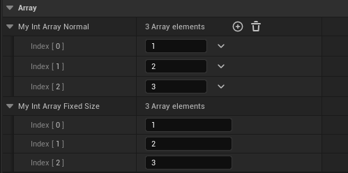

# EditFixedSize

- **功能描述：** 在细节面板上不允许改变该容器的元素个数。

- **元数据类型：** bool
- **引擎模块：** DetailsPanel, Editor
- **限制类型：** TArray<T>，TSet<T>，TMap<T>
- **作用机制：** 在PropertyFlags中加入CPF_EditFixedSize
- **常用程度：** ★★★

在细节面板上不允许改变该容器的元素个数。

只适用于容器。这能防止用户通过虚幻编辑器属性窗口修改容器的元素个数。

但在C++代码和蓝图中依然是可以修改的。

## 示例代码：

以TArray为例，其他同理。

```cpp
UPROPERTY(EditAnywhere, Category = Array)
		TArray<int32> MyIntArray_Normal{1,2,3};

	UPROPERTY(EditAnywhere, EditFixedSize,Category = Array)
		TArray<int32> MyIntArray_FixedSize{1,2,3};
```

## 示例效果：

蓝图中的表现，前者可以动态再添加元素。后者不可。



## 原理：

如果有CPF_EditFixedSize，则不会添加+和清空的按钮。

```cpp
void PropertyEditorHelpers::GetRequiredPropertyButtons( TSharedRef<FPropertyNode> PropertyNode, TArray<EPropertyButton::Type>& OutRequiredButtons, bool bUsingAssetPicker )
{
	// Handle a container property.
	if( NodeProperty->IsA(FArrayProperty::StaticClass()) || NodeProperty->IsA(FSetProperty::StaticClass()) || NodeProperty->IsA(FMapProperty::StaticClass()) )
	{
		if( !(NodeProperty->PropertyFlags & CPF_EditFixedSize) )
		{
			OutRequiredButtons.Add( EPropertyButton::Add );
			OutRequiredButtons.Add( EPropertyButton::Empty );
		}
	}
}
```

## 行为

在 UE5.8 UHT 中写入 `CPF_EditFixedSize`，用于限制编辑器中容器大小编辑。它不改变 C++ 运行时容器本身的可变性。

## UE5.8 审计结论

- 状态：`verified_UE5.8`。
- 结论：已按 UE5.8 源码验证。
- 证据：
  - UE5.8 `UhtPropertyMemberSpecifiers.cs` 对应 specifier 分支
- 批次记录：`references/audits/ue5.8-p0-complete-pass.md`。

## 常见误用

以为运行时代码不能 Add/Remove；或用于非容器属性期待有尺寸按钮变化。
