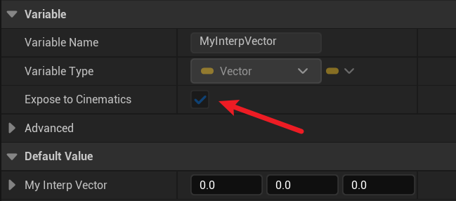

# Interp

- **功能描述：** 指定该属性值可暴露到时间轴里编辑，在平常的Timeline或UMG的动画里使用。

- **元数据类型：** bool
- **引擎模块：** Sequencer
- **作用机制：** 在PropertyFlags中加入CPF_Edit, CPF_BlueprintVisible, CPF_Interp
- **常用程度：** ★★★

该属性可以暴露到时间轴里，一般用来编辑动画。

## 示例代码：

```cpp
UCLASS(Blueprintable, BlueprintType)
class INSIDER_API AMyProperty_Interp :public AActor
{
public:
	GENERATED_BODY()
public:
	UPROPERTY(EditAnywhere, BlueprintReadWrite, Interp, Category = Animation)
		FVector MyInterpVector;
};
```

## 示例效果：

影响的是属性上的该标志



从而可以在Sequencer里对该属性添加Track


## 行为

在 UE5.8 UHT 中写入 `CPF_Edit | CPF_BlueprintVisible | CPF_Interp`，用于可插值/可关键帧编辑的属性暴露。

## UE5.8 审计结论

- 状态：`verified_UE5.8`。
- 结论：已按 UE5.8 源码验证。
- 证据：
  - UE5.8 `UhtPropertyMemberSpecifiers.cs` 对应 specifier 分支
- 批次记录：`references/audits/ue5.8-p0-complete-pass.md`。

## 常见误用

以为它自动复制或自动驱动动画；它只是属性标志和编辑器暴露基础。
